# Kontaktboka – full oversikt

> Dette dokumentet viser hvordan hele Kontaktboka-appen henger sammen.
> Diagrammene bruker Mermaid og kan vises direkte i VS Code dersom Mermaid-extensionen er installert.

---

# 1. Helheten i applikasjonen

Kontaktboka er bygget rundt prinsippet:

**Brukerhandling → Controller → Modellendring → `updateView()` → View → Ny HTML**

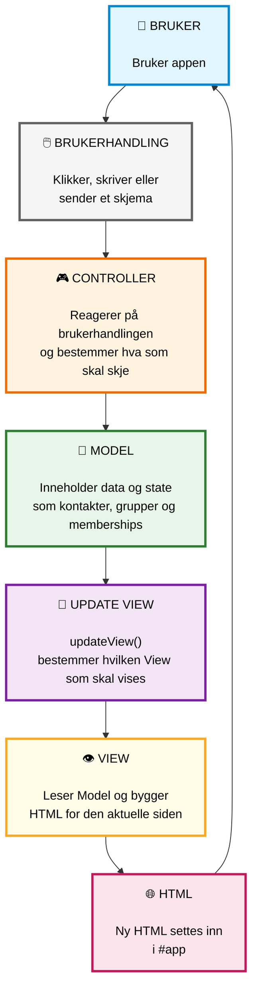

---

# 2. Filstrukturen

Applikasjonen består av `index.html` og flere JavaScript-filer.

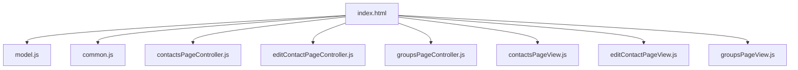

## Hva gjør filene?

| Fil | Ansvar |
|---|---|
| `index.html` | HTML-skjelett, navigasjon og lasting av JavaScript |
| `model.js` | Inneholder modell og all state |
| `common.js` | Felles hjelpefunksjoner |
| `contactsPageController.js` | Handlinger på kontaktsiden |
| `editContactPageController.js` | Opprette og redigere kontakter |
| `groupsPageController.js` | Handlinger for grupper |
| `contactsPageView.js` | Viser kontaktsiden |
| `editContactPageView.js` | Viser redigeringssiden |
| `groupsPageView.js` | Viser gruppesiden |

---

# 3. MVC-arkitekturen

Applikasjonen kan forstås som tre hoveddeler:

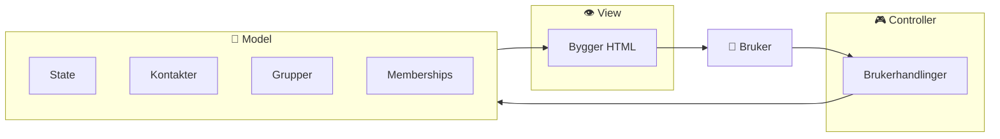

### Controller

Controlleren reagerer på brukerhandlinger.

Eksempler:

```text
startNewContact()
startEditContact()
saveContact()
cancelEditContact()
deleteContact()
createGroup()
goToContactsPage()
goToGroupsPage()
```

### Model

Modellen inneholder dataene:

```text
model
├── app
├── viewState
├── contacts
├── groups
└── memberships
```

### View

View-funksjonene leser data fra modellen og bygger HTML.

---

# 4. Model

Modellen er selve datagrunnlaget i applikasjonen.

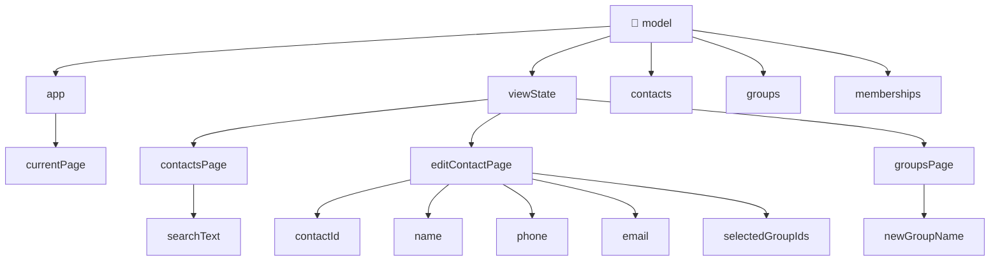

Modellen kan derfor tegnes slik:

```text
model
│
├── app
│   └── currentPage
│
├── viewState
│   ├── contactsPage
│   │   └── searchText
│   │
│   ├── editContactPage
│   │   ├── contactId
│   │   ├── name
│   │   ├── phone
│   │   ├── email
│   │   └── selectedGroupIds
│   │
│   └── groupsPage
│       └── newGroupName
│
├── contacts
│
├── groups
│
└── memberships
```

---

# 5. `app.currentPage`

`currentPage` bestemmer hvilken side brukeren befinner seg på.

```javascript
app: {
    currentPage: 'contactsPage'
}
```

Mulige sider:

```text
contactsPage
editContactPage
groupsPage
```

Flyten mellom sidene:

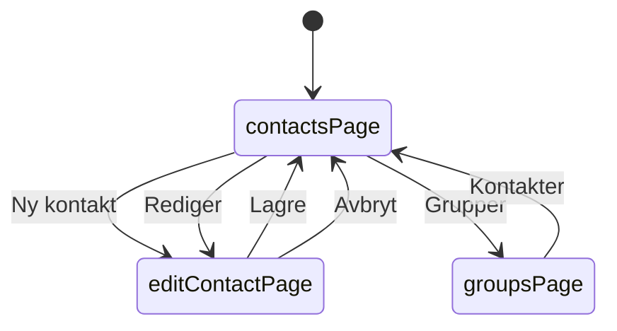

---

# 6. `viewState`

`viewState` inneholder midlertidig informasjon som brukeren holder på å redigere.

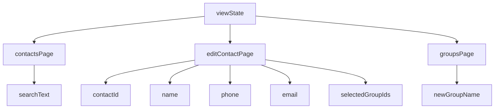

Det er viktig å skille mellom:

```text
viewState
```

og:

```text
model.contacts
```

`viewState` er arbeidsutkastet.

`model.contacts` er de lagrede domenedataene.

---

# 7. Hvorfor bruker vi `viewState`?

Når brukeren redigerer en kontakt, skal ikke den eksisterende kontakten endres med én gang.

I stedet kopieres dataene først:

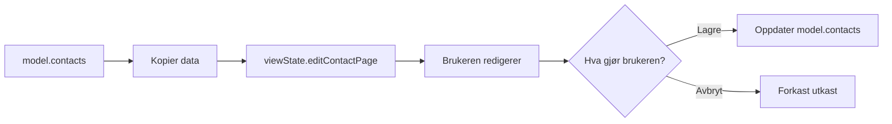

Dette gjør at **Avbryt** fungerer uten at den lagrede kontakten blir endret.

---

# 8. Kontakter

En kontakt består av:

```javascript
{
    id: 1,
    name: 'Terje',
    phone: '12345678',
    email: 'terje@example.com'
}
```

Modellen starter med tre kontakter:

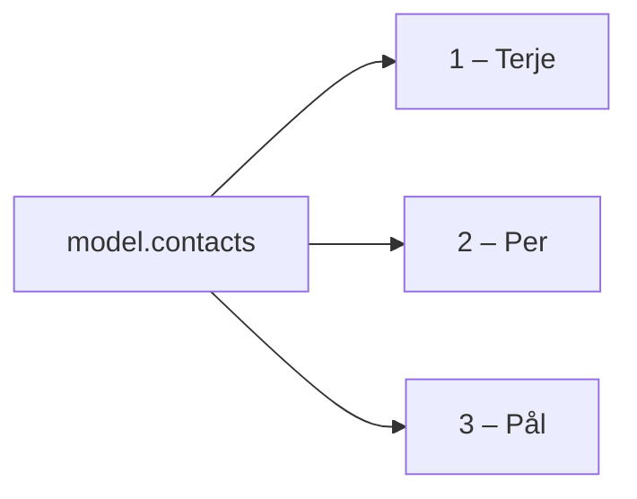

---

# 9. Grupper

En gruppe består av:

```javascript
{
    id: 1,
    name: 'Sykling'
}
```

Modellen starter med:

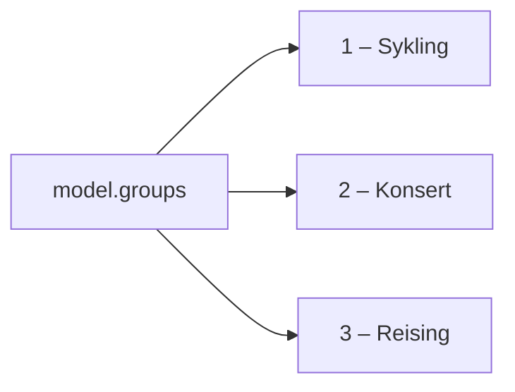

---

# 10. Mange-til-mange-relasjonen

En kontakt kan være medlem av flere grupper.

En gruppe kan ha flere kontakter.

Derfor bruker modellen en egen liste:

```text
memberships
```

Strukturen er:

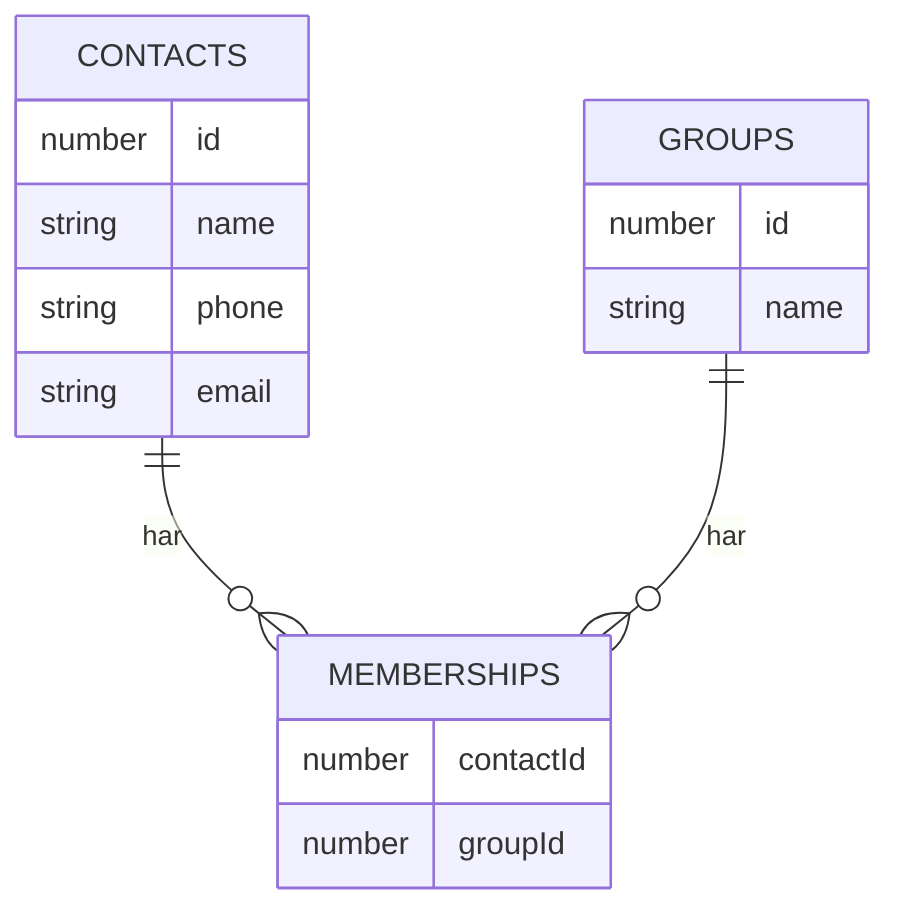

Eksempel:

```javascript
memberships: [
    { contactId: 1, groupId: 1 },
    { contactId: 1, groupId: 3 },
    { contactId: 2, groupId: 2 }
]
```

Dette betyr:

```text
Terje → Sykling
Terje → Reising
Per   → Konsert
```

---

# 11. Hvorfor bruker vi `memberships`?

Vi lagrer ikke hele gruppeobjektet inne i kontakten.

Vi lagrer bare ID-ene.

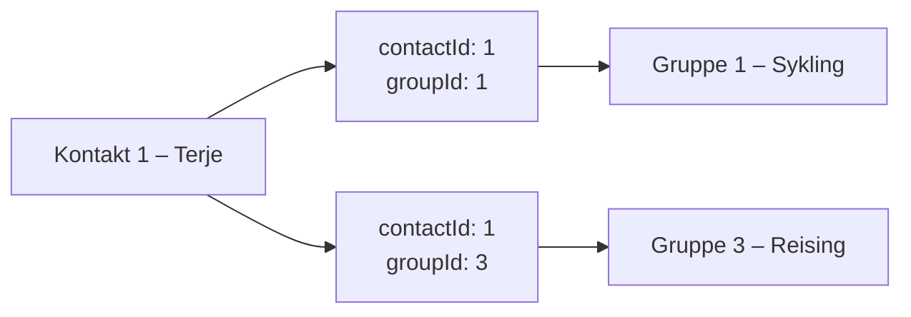

Dette følger prinsippet:

> **Relasjoner lagres som ID-er. Relasjoner beregnes når de trengs.**

---

# 12. `findObjectById()`

Denne funksjonen finner et objekt basert på ID.

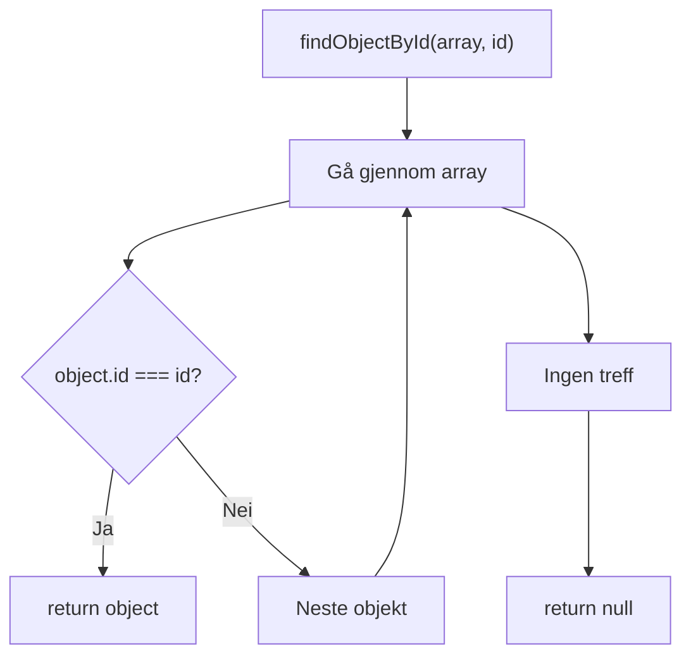

Eksempel:

```javascript
findObjectById(model.contacts, 2)
```

Resultatet blir kontakt nummer 2.

---

# 13. `getNextId()`

Denne funksjonen finner høyeste eksisterende ID og returnerer neste ID.

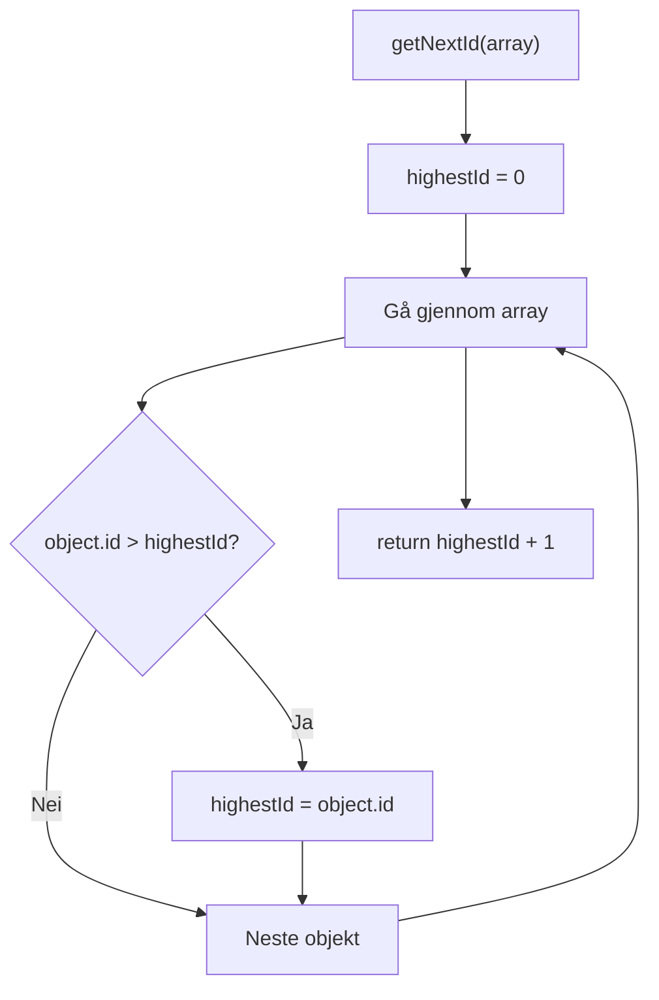

Hvis ID-ene er:

```text
1
2
3
```

blir neste ID:

```text
4
```

---

# 14. `copyArray()`

`copyArray()` lager en ny array og kopierer elementene over.

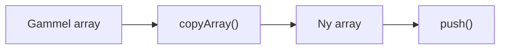

Den brukes blant annet når en ny gruppe opprettes.

---

# 15. `getGroupsForContact()`

Denne funksjonen finner gruppene som en kontakt er medlem av.

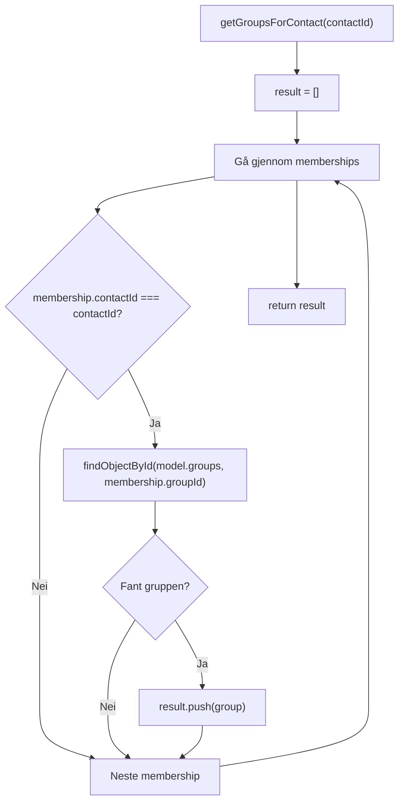

Eksempel:

```text
getGroupsForContact(1)
```

gir:

```text
Sykling
Reising
```

---

# 16. `getContactsForGroup()`

Dette er motsatt vei.

Funksjonen finner kontaktene som er medlem av en gruppe.

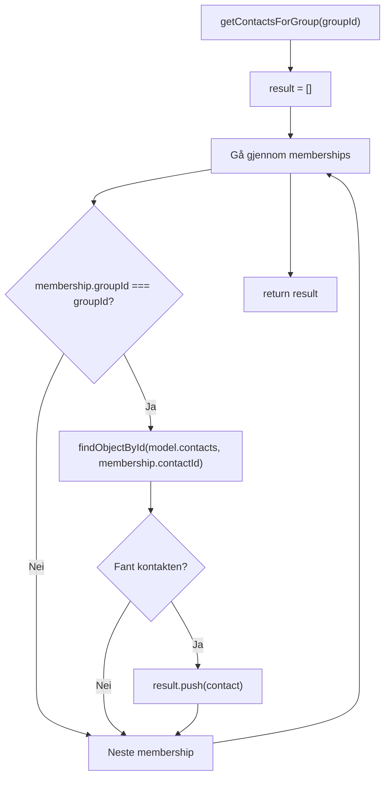

Eksempel:

```text
getContactsForGroup(1)
```

gir:

```text
Terje
```

---

# 17. `getFilteredContacts()`

Denne funksjonen lager trefflisten når brukeren søker.

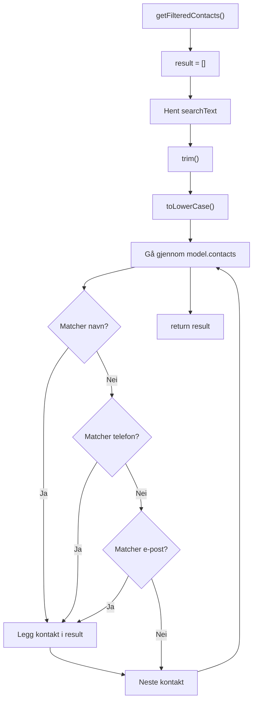

Viktig prinsipp:

> **Bare søketeksten lagres. Trefflisten beregnes når den skal vises.**

---

# 18. `escapeHtml()`

Brukerens tekst settes inn i HTML.

Derfor må spesielle tegn gjøres om slik at de behandles som tekst.

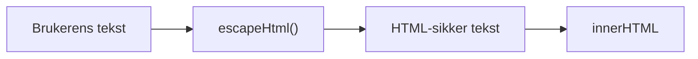

Eksempel:

```text
<hello>
```

blir:

```text
&lt;hello&gt;
```

Funksjonen håndterer:

| Tegn | Resultat |
|---|---|
| `&` | `&amp;` |
| `<` | `&lt;` |
| `>` | `&gt;` |
| `"` | `&quot;` |
| `'` | `&#39;` |

---

# 19. `updateView()`

Dette er sentralpunktet for visningen.

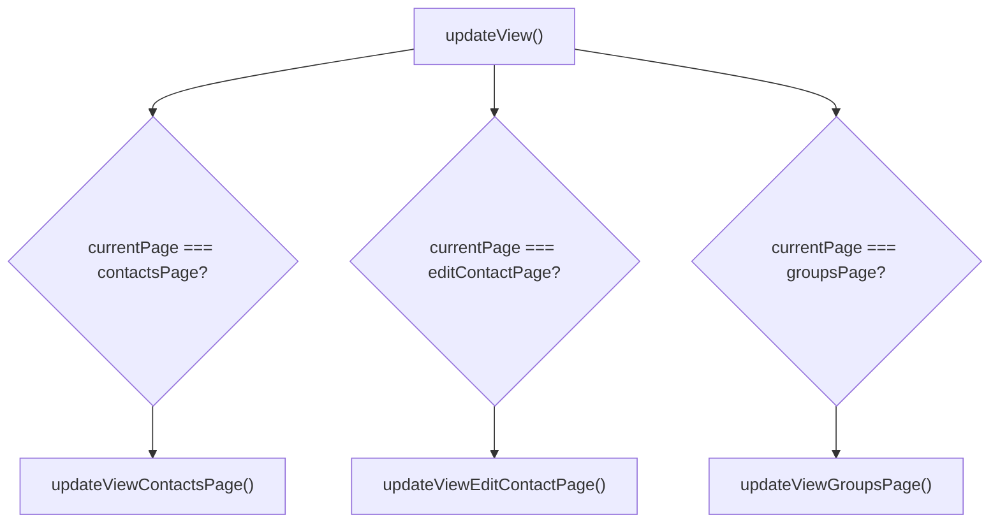

`updateView()` fungerer som en enkel router.

Den spør:

> Hvilken side er aktiv?

Deretter kalles riktig View-funksjon.

---

# 20. Kontaktsiden

Kontaktsiden bygges gjennom flere funksjoner:

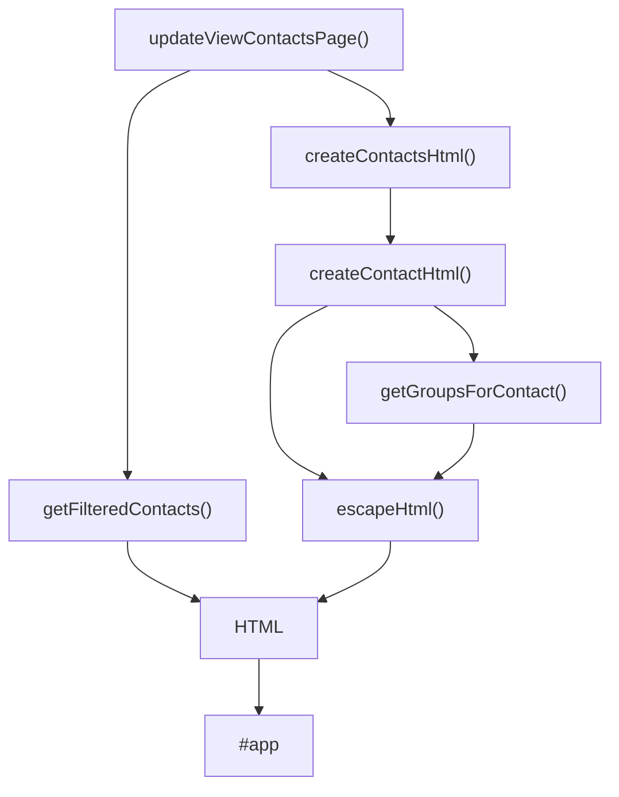

---

# 21. `createContactsHtml()`

Funksjonen lager HTML for alle kontaktene.

```mermaid
flowchart TD

    START["createContactsHtml(contacts)"]

    START --> EMPTY{"contacts.length === 0?"}

    EMPTY -->|Ja| MESSAGE["Vis melding om ingen kontakter"]

    EMPTY -->|Nei| LOOP["Gå gjennom contacts"]

    LOOP --> CREATE["createContactHtml(contact)"]

    CREATE --> CONCAT["Legg HTML til html"]

    CONCAT --> LOOP

    LOOP --> RETURN["return html"]
```

---

# 22. `createContactHtml()`

Denne funksjonen lager ett kontaktkort.

```mermaid
flowchart TD

    START["createContactHtml(contact)"]

    START --> GROUPS["getGroupsForContact(contact.id)"]

    GROUPS --> NAMES["Bygg gruppenavn"]

    NAMES --> EMPTY{"Ingen grupper?"}

    EMPTY -->|Ja| NONE["groupNames = Ingen"]

    EMPTY -->|Nei| HTML["Lag kontaktkort"]

    NONE --> HTML

    HTML --> ESCAPE["escapeHtml()"]

    ESCAPE --> RETURN["return HTML"]
```

Kontaktkortet inneholder:

```text
Navn
Telefon
E-post
Grupper
Rediger
Slett
```

---

# 23. Opprette ny kontakt

Når brukeren klikker **Ny kontakt**:

```mermaid
sequenceDiagram

    actor User
    participant View
    participant Controller
    participant Model

    User->>View: Klikker "Ny kontakt"

    View->>Controller: startNewContact()

    Controller->>Model: clearEditContactViewState()

    Controller->>Model: currentPage = editContactPage

    Controller->>View: updateView()

    View-->>User: Viser kontaktskjema
```

---

# 24. `startNewContact()`

Funksjonen gjør:

```text
clearEditContactViewState()
        ↓
currentPage = editContactPage
        ↓
updateView()
```

Altså:

1. Tømmer arbeidsutkastet.
2. Bytter til redigeringssiden.
3. Tegner siden på nytt.

---

# 25. Redigere kontakt

Når brukeren klikker **Rediger**:

```mermaid
sequenceDiagram

    actor User
    participant View
    participant Controller
    participant Model

    User->>View: Klikker "Rediger"

    View->>Controller: startEditContact(contactId)

    Controller->>Model: findObjectById()

    Model-->>Controller: Kontakt

    Controller->>Model: Kopierer kontaktdata til viewState

    Controller->>Model: Leser memberships

    Controller->>Model: Fyller selectedGroupIds

    Controller->>Model: currentPage = editContactPage

    Controller->>View: updateView()

    View-->>User: Viser redigeringsskjema
```

---

# 26. Hva skjer i `startEditContact()`?

Data flyttes fra modellen til arbeidsutkastet:

```mermaid
flowchart LR

    MODEL["model.contacts"]

    MODEL --> FIND["findObjectById()"]

    FIND --> CONTACT["Eksisterende kontakt"]

    CONTACT --> COPY["Kopier feltene"]

    COPY --> VIEWSTATE["viewState.editContactPage"]

    VIEWSTATE --> FORM["Redigeringsskjema"]
```

Den lagrede kontakten endres altså ikke ennå.

---

# 27. Redigeringsskjemaet

Skjemaet består av:

```mermaid
flowchart TD

    FORM["Redigeringsskjema"]

    FORM --> NAME["Navn"]

    FORM --> PHONE["Telefon"]

    FORM --> EMAIL["E-post"]

    FORM --> GROUPS["Grupper"]

    FORM --> SAVE["Lagre"]

    FORM --> CANCEL["Avbryt"]

    NAME --> STATE["viewState"]

    PHONE --> STATE

    EMAIL --> STATE

    GROUPS --> STATE
```

Input-feltene endrer bare `viewState`.

Eksempel:

```text
input
  ↓
this.value
  ↓
model.viewState.editContactPage.name
```

---

# 28. `toggleGroupForEditedContact()`

Når brukeren krysser av en gruppe:

```mermaid
flowchart TD

    CLICK["Klikk checkbox"]

    CLICK --> IDS["selectedGroupIds"]

    IDS --> EXISTS{"Finnes groupId allerede?"}

    EXISTS -->|Ja| REMOVE["Fjern groupId"]

    EXISTS -->|Nei| ADD["Legg til groupId"]

    REMOVE --> NEWSTATE["Nytt selectedGroupIds"]

    ADD --> NEWSTATE
```

Dette endrer fortsatt bare arbeidsutkastet.

---

# 29. `saveContact()`

Når brukeren trykker **Lagre**, skjer flere ting.

```mermaid
flowchart TD

    SAVE["saveContact()"]

    SAVE --> STATE["Hent viewState"]

    STATE --> VALIDATE{"Er navnet tomt?"}

    VALIDATE -->|Ja| STOP["return"]

    VALIDATE -->|Nei| ID{"Ny kontakt?"}

    ID -->|Ja| NEXTID["getNextId(model.contacts)"]

    ID -->|Nei| EXISTING["Bruk eksisterende ID"]

    NEXTID --> OBJECT["Lag updatedContact"]

    EXISTING --> OBJECT

    OBJECT --> CONTACTS["Bygg newContacts"]

    CONTACTS --> MEMBERSHIPS["Bygg newMemberships"]

    MEMBERSHIPS --> CLEAR["clearEditContactViewState()"]

    CLEAR --> PAGE["currentPage = contactsPage"]

    PAGE --> UPDATE["updateView()"]
```

---

# 30. Ny eller eksisterende kontakt?

Hvis:

```javascript
viewState.contactId === null
```

er kontakten ny.

Da brukes:

```javascript
getNextId(model.contacts)
```

Hvis kontakten allerede finnes, brukes den eksisterende ID-en.

---

# 31. Oppdatere `contacts`

Når kontakten lagres, bygges en ny array.

```mermaid
flowchart LR

    OLD["model.contacts"]

    OLD --> LOOP["Gå gjennom kontaktene"]

    LOOP --> MATCH{"Samme ID?"}

    MATCH -->|Ja| UPDATED["Legg inn updatedContact"]

    MATCH -->|Nei| ORIGINAL["Behold eksisterende kontakt"]

    UPDATED --> NEW["newContacts"]

    ORIGINAL --> NEW

    NEW --> MODEL["model.contacts = newContacts"]
```

Prinsippet er:

> Bygg en ny array og et nytt kontaktobjekt.

---

# 32. Oppdatere `memberships`

Når en kontakt lagres:

1. Behold medlemskap for andre kontakter.
2. Fjern medlemskapene til kontakten som redigeres.
3. Lag nye medlemskap basert på `selectedGroupIds`.

```mermaid
flowchart TD

    OLD["model.memberships"]

    OLD --> KEEP["Behold andre kontakter"]

    OLD --> REMOVE["Fjern denne kontaktens memberships"]

    REMOVE --> SELECTED["selectedGroupIds"]

    SELECTED --> ADD["Lag nye memberships"]

    KEEP --> COMBINE["Ny memberships-array"]

    ADD --> COMBINE

    COMBINE --> MODEL["model.memberships"]
```

---

# 33. Avbryt redigering

Når brukeren trykker **Avbryt**:

```mermaid
flowchart TD

    CANCEL["cancelEditContact()"]

    CANCEL --> CLEAR["clearEditContactViewState()"]

    CLEAR --> PAGE["currentPage = contactsPage"]

    PAGE --> UPDATE["updateView()"]

    UPDATE --> SCREEN["Kontaktsiden"]
```

Det viktigste:

**`model.contacts` blir ikke endret.**

Arbeidsutkastet forkastes.

---

# 34. Gruppesiden

Gruppesiden bygges gjennom:

```mermaid
flowchart TD

    VIEW["updateViewGroupsPage()"]

    VIEW --> GROUPS["createGroupsHtml()"]

    GROUPS --> GROUP["createGroupHtml()"]

    GROUP --> CONTACTS["getContactsForGroup()"]

    CONTACTS --> MEMBERS["createGroupMembersHtml()"]

    MEMBERS --> HTML["HTML"]

    HTML --> APP["#app"]
```

---

# 35. Opprette gruppe

Når brukeren oppretter en gruppe:

```mermaid
flowchart TD

    START["createGroup()"]

    START --> STATE["Hent newGroupName"]

    STATE --> TRIM["trim()"]

    TRIM --> EMPTY{"Tomt?"}

    EMPTY -->|Ja| STOP["return"]

    EMPTY -->|Nei| ID["getNextId(model.groups)"]

    ID --> OBJECT["Lag newGroup"]

    OBJECT --> COPY["copyArray(model.groups)"]

    COPY --> PUSH["push(newGroup)"]

    PUSH --> REPLACE["model.groups = newGroups"]

    REPLACE --> CLEAR["Tøm newGroupName"]

    CLEAR --> UPDATE["updateView()"]
```

---

# 36. `createGroupHtml()`

Gruppen lagrer ikke sin egen kontaktliste.

Kontaktene finnes via `memberships`.

```mermaid
flowchart LR

    GROUP["group"]

    GROUP --> ID["group.id"]

    ID --> LOOKUP["getContactsForGroup()"]

    LOOKUP --> CONTACTS["Kontakter"]

    CONTACTS --> HTML["createGroupMembersHtml()"]

    HTML --> VIEW["Gruppekort"]
```

---

# 37. Slette kontakt

Når en kontakt slettes:

```mermaid
flowchart TD

    DELETE["deleteContact(contactId)"]

    DELETE --> FIND["findObjectById()"]

    FIND --> EXISTS{"Fant kontakt?"}

    EXISTS -->|Nei| STOP["return"]

    EXISTS -->|Ja| INDEX["Finn index"]

    INDEX --> SPLICE["splice() kontakt"]

    SPLICE --> MEMBERS["Gå gjennom memberships"]

    MEMBERS --> CHECK{"contactId matcher?"}

    CHECK -->|Ja| REMOVE["splice() membership"]

    CHECK -->|Nei| NEXT["Neste membership"]

    REMOVE --> NEXT

    NEXT --> MEMBERS

    MEMBERS --> UPDATE["updateView()"]
```

---

# 38. Hvorfor går slettingen baklengs?

`splice()` endrer arrayen.

Når et element fjernes, flyttes elementene etter det.

Derfor går koden:

```javascript
for (let i = model.memberships.length - 1; i >= 0; i--)
```

Altså:

```text
siste element
      ↓
...
      ↓
første element
```

Da unngår vi å hoppe over elementer.

---

# 39. Navigasjon

Navigasjonen kan vises slik:

```mermaid
stateDiagram-v2

    [*] --> Kontakter

    Kontakter --> Redigering : Ny kontakt

    Kontakter --> Redigering : Rediger

    Redigering --> Kontakter : Lagre

    Redigering --> Kontakter : Avbryt

    Kontakter --> Grupper : Grupper

    Grupper --> Kontakter : Kontakter
```

---

# 40. Full navigasjon

```mermaid
flowchart TD

    CONTACTS["📇 Kontaktside"]

    CONTACTS --> NEW["➕ Ny kontakt"]

    NEW --> EDIT["✏️ Redigeringsside"]

    CONTACTS --> EDIT_EXISTING["✏️ Rediger"]

    EDIT_EXISTING --> EDIT

    EDIT --> SAVE["💾 Lagre"]

    SAVE --> CONTACTS

    EDIT --> CANCEL["↩️ Avbryt"]

    CANCEL --> CONTACTS

    CONTACTS --> GROUPS["👥 Gruppeside"]

    GROUPS --> CONTACTS
```

---

# 41. Søkeflyt

Når brukeren søker:

```mermaid
sequenceDiagram

    actor User
    participant Browser
    participant Model
    participant View

    User->>Browser: Skriver søketekst

    Browser->>Model: searchText = this.value

    User->>Browser: Klikker Filtrer

    Browser->>View: updateViewContactsPage()

    View->>Model: getFilteredContacts()

    Model->>Model: Leser searchText

    Model->>Model: Leser contacts

    Model->>Model: Sjekker navn

    Model->>Model: Sjekker telefon

    Model->>Model: Sjekker e-post

    Model-->>View: Filtrerte kontakter

    View-->>Browser: Bygger HTML

    Browser-->>User: Viser treff
```

---

# 42. Komplett flyt ved redigering

```mermaid
sequenceDiagram

    actor User
    participant Browser
    participant Controller
    participant Model
    participant View

    User->>Browser: Klikker "Rediger"

    Browser->>Controller: startEditContact(1)

    Controller->>Model: findObjectById()

    Model-->>Controller: Terje

    Controller->>Model: Kopier data til viewState

    Controller->>Model: Finn memberships

    Controller->>Model: currentPage = editContactPage

    Controller->>View: updateView()

    View->>Model: Les viewState

    View-->>Browser: Vis redigeringsskjema

    User->>Browser: Endrer navn

    Browser->>Model: viewState.name = nytt navn

    User->>Browser: Klikker Lagre

    Browser->>Controller: saveContact()

    Controller->>Model: Lag updatedContact

    Controller->>Model: Oppdater contacts

    Controller->>Model: Oppdater memberships

    Controller->>Model: currentPage = contactsPage

    Controller->>View: updateView()

    View-->>Browser: Tegn kontaktsiden på nytt

    Browser-->>User: Viser oppdatert kontakt
```

---

# 43. Komplett flyt ved sletting

```mermaid
sequenceDiagram

    actor User
    participant Browser
    participant Controller
    participant Model
    participant View

    User->>Browser: Klikker "Slett"

    Browser->>Controller: deleteContact(id)

    Controller->>Model: findObjectById()

    Model-->>Controller: Kontakt

    Controller->>Model: Finn index

    Controller->>Model: splice kontakt

    Controller->>Model: Finn memberships

    Controller->>Model: Fjern memberships

    Controller->>View: updateView()

    View-->>Browser: Ny HTML

    Browser-->>User: Oppdatert kontaktliste
```

---

# 44. Komplett flyt ved oppretting av gruppe

```mermaid
sequenceDiagram

    actor User
    participant Browser
    participant Controller
    participant Model
    participant View

    User->>Browser: Skriver gruppenavn

    Browser->>Model: newGroupName = this.value

    User->>Browser: Klikker Opprett gruppe

    Browser->>Controller: createGroup()

    Controller->>Model: getNextId()

    Controller->>Model: copyArray(groups)

    Controller->>Model: push(newGroup)

    Controller->>Model: groups = newGroups

    Controller->>Model: Tøm newGroupName

    Controller->>View: updateView()

    View-->>Browser: Viser ny gruppe
```

---

# 45. Common helper-funksjoner

De felles hjelpefunksjonene kan vises slik:

```mermaid
flowchart TD

    COMMON["common.js"]

    COMMON --> FIND["findObjectById()"]

    COMMON --> NEXTID["getNextId()"]

    COMMON --> COPY["copyArray()"]

    COMMON --> GROUPS["getGroupsForContact()"]

    COMMON --> CONTACTS["getContactsForGroup()"]

    COMMON --> FILTER["getFilteredContacts()"]

    COMMON --> ESCAPE["escapeHtml()"]
```

---

# 46. Controller-funksjoner

Controllerne håndterer brukerhandlingene.

```mermaid
flowchart TD

    CONTROLLERS["🎮 Controllers"]

    CONTROLLERS --> NEW["startNewContact()"]

    CONTROLLERS --> EDIT["startEditContact()"]

    CONTROLLERS --> TOGGLE["toggleGroupForEditedContact()"]

    CONTROLLERS --> SAVE["saveContact()"]

    CONTROLLERS --> CANCEL["cancelEditContact()"]

    CONTROLLERS --> DELETE["deleteContact()"]

    CONTROLLERS --> CREATE["createGroup()"]

    CONTROLLERS --> NAV1["goToContactsPage()"]

    CONTROLLERS --> NAV2["goToGroupsPage()"]
```

---

# 47. View-funksjoner

View-funksjonene bygger HTML.

```mermaid
flowchart TD

    VIEWS["👁️ Views"]

    VIEWS --> CONTACT_VIEW["Kontaktside"]

    CONTACT_VIEW --> UPDATE_CONTACT["updateViewContactsPage()"]
    CONTACT_VIEW --> CREATE_CONTACTS["createContactsHtml()"]
    CONTACT_VIEW --> CREATE_CONTACT["createContactHtml()"]

    VIEWS --> EDIT_VIEW["Redigeringsside"]

    EDIT_VIEW --> UPDATE_EDIT["updateViewEditContactPage()"]
    EDIT_VIEW --> CHECKBOXES["createGroupCheckboxesHtml()"]
    EDIT_VIEW --> CHECKBOX["createGroupCheckboxHtml()"]

    VIEWS --> GROUP_VIEW["Gruppeside"]

    GROUP_VIEW --> UPDATE_GROUP["updateViewGroupsPage()"]
    GROUP_VIEW --> CREATE_GROUPS["createGroupsHtml()"]
    GROUP_VIEW --> CREATE_GROUP["createGroupHtml()"]
    GROUP_VIEW --> MEMBERS["createGroupMembersHtml()"]
```

---

# 48. Hele dataflyten

Dette er den viktigste flyten i hele applikasjonen:

```mermaid
flowchart TB

    USER["👤 Bruker"]

    USER --> EVENT["Brukerhandling"]

    EVENT --> CONTROLLER["🎮 Controller"]

    CONTROLLER --> MODEL["🧠 Model"]

    MODEL --> UPDATE["🔄 updateView()"]

    UPDATE --> VIEW["👁️ View"]

    VIEW --> HTML["🌐 Ny HTML"]

    HTML --> DOM["DOM"]

    DOM --> USER
```

Dette betyr:

1. Brukeren gjør noe.
2. Controlleren reagerer.
3. Controlleren endrer modellen.
4. `updateView()` kjøres.
5. View leser modellen.
6. View bygger ny HTML.
7. HTML settes inn i `#app`.
8. Brukeren ser resultatet.

---

# 49. Full modelloversikt

```mermaid
flowchart TB

    MODEL["🧠 MODEL"]

    MODEL --> APP["app"]

    APP --> PAGE["currentPage"]

    MODEL --> STATE["viewState"]

    STATE --> CONTACTSTATE["contactsPage"]

    CONTACTSTATE --> SEARCH["searchText"]

    STATE --> EDITSTATE["editContactPage"]

    EDITSTATE --> ID["contactId"]
    EDITSTATE --> NAME["name"]
    EDITSTATE --> PHONE["phone"]
    EDITSTATE --> EMAIL["email"]
    EDITSTATE --> SELECTED["selectedGroupIds"]

    STATE --> GROUPSTATE["groupsPage"]

    GROUPSTATE --> NEWNAME["newGroupName"]

    MODEL --> CONTACTS["contacts"]

    CONTACTS --> TERJE["Terje"]
    CONTACTS --> PER["Per"]
    CONTACTS --> PAL["Pål"]

    MODEL --> GROUPS["groups"]

    GROUPS --> SYKLING["Sykling"]
    GROUPS --> KONSERT["Konsert"]
    GROUPS --> REISING["Reising"]

    MODEL --> MEMBERSHIPS["memberships"]

    MEMBERSHIPS --> M1["1 → 1"]
    MEMBERSHIPS --> M2["1 → 3"]
    MEMBERSHIPS --> M3["2 → 2"]
```

---

# 50. Hele arkitekturen i én figur

```mermaid
flowchart TB

    USER["👤 BRUKER"]

    USER --> EVENT["Brukerhandling"]

    subgraph CONTROLLERS["🎮 CONTROLLERS"]

        CONTACT_CONTROLLER["Kontakt-controller"]

        EDIT_CONTROLLER["Edit-contact controller"]

        GROUP_CONTROLLER["Gruppe-controller"]

    end

    EVENT --> CONTACT_CONTROLLER
    EVENT --> EDIT_CONTROLLER
    EVENT --> GROUP_CONTROLLER

    subgraph MODEL["🧠 MODEL"]

        APP["app"]

        VIEWSTATE["viewState"]

        CONTACTS["contacts"]

        GROUPS["groups"]

        MEMBERSHIPS["memberships"]

    end

    CONTACT_CONTROLLER --> MODEL
    EDIT_CONTROLLER --> MODEL
    GROUP_CONTROLLER --> MODEL

    subgraph HELPERS["🔧 COMMON HELPERS"]

        FIND["findObjectById()"]

        NEXTID["getNextId()"]

        COPY["copyArray()"]

        RELATIONS["Relasjonsoppslag"]

        FILTER["getFilteredContacts()"]

        ESCAPE["escapeHtml()"]

    end

    CONTACT_CONTROLLER --> HELPERS
    EDIT_CONTROLLER --> HELPERS
    GROUP_CONTROLLER --> HELPERS

    UPDATE["🔄 updateView()"]

    MODEL --> UPDATE

    subgraph VIEWS["👁️ VIEWS"]

        CONTACT_VIEW["Kontaktside"]

        EDIT_VIEW["Redigeringsside"]

        GROUP_VIEW["Gruppeside"]

    end

    UPDATE --> CONTACT_VIEW
    UPDATE --> EDIT_VIEW
    UPDATE --> GROUP_VIEW

    CONTACT_VIEW --> HTML["🌐 HTML"]
    EDIT_VIEW --> HTML
    GROUP_VIEW --> HTML

    HTML --> DOM["DOM"]

    DOM --> USER
```

---

# 51. Relasjonene mellom kontakter og grupper

Dette diagrammet viser spesielt godt hvordan `memberships` fungerer:

```mermaid
flowchart LR

    subgraph CONTACTS["Kontakter"]

        TERJE["👤 Terje<br>ID: 1"]

        PER["👤 Per<br>ID: 2"]

        PAL["👤 Pål<br>ID: 3"]

    end

    subgraph MEMBERSHIPS["memberships"]

        M1["contactId: 1<br>groupId: 1"]

        M2["contactId: 1<br>groupId: 3"]

        M3["contactId: 2<br>groupId: 2"]

    end

    subgraph GROUPS["Grupper"]

        SYKLING["🚴 Sykling<br>ID: 1"]

        KONSERT["🎵 Konsert<br>ID: 2"]

        REISING["✈️ Reising<br>ID: 3"]

    end

    TERJE --> M1
    TERJE --> M2

    PER --> M3

    M1 --> SYKLING
    M2 --> REISING
    M3 --> KONSERT
```

---

# 52. Hvorfor beregne relasjoner?

I stedet for å lagre:

```javascript
{
    id: 1,
    name: 'Terje',
    groups: [
        { id: 1, name: 'Sykling' },
        { id: 3, name: 'Reising' }
    ]
}
```

lagres kontakten separat:

```javascript
{
    id: 1,
    name: 'Terje',
    phone: '12345678',
    email: 'terje@example.com'
}
```

og gruppene separat:

```javascript
[
    { id: 1, name: 'Sykling' },
    { id: 2, name: 'Konsert' },
    { id: 3, name: 'Reising' }
]
```

mens koblingen ligger i:

```javascript
[
    { contactId: 1, groupId: 1 },
    { contactId: 1, groupId: 3 }
]
```

Dette gjør modellen mer normalisert og unngår duplisering av data.

---

# 53. Controller → Model → View

Den grunnleggende syklusen er:

```mermaid
flowchart LR

    ACTION["👤 Brukerhandling"]

    ACTION --> CONTROLLER["🎮 Controller"]

    CONTROLLER --> CHANGE["Endrer Model"]

    CHANGE --> UPDATE["updateView()"]

    UPDATE --> VIEW["👁️ View"]

    VIEW --> HTML["HTML"]

    HTML --> SCREEN["🖥️ Skjerm"]

    SCREEN --> ACTION
```

Dette er en kontinuerlig syklus.

---

# 54. Eksempel: Brukeren endrer navn

```mermaid
flowchart TD

    USER["👤 Bruker"]

    USER --> INPUT["Skriver nytt navn"]

    INPUT --> VIEWSTATE["viewState.name"]

    VIEWSTATE --> SAVE["Klikker Lagre"]

    SAVE --> CONTROLLER["saveContact()"]

    CONTROLLER --> UPDATED["updatedContact"]

    UPDATED --> CONTACTS["model.contacts"]

    CONTACTS --> UPDATEVIEW["updateView()"]

    UPDATEVIEW --> VIEW["Kontaktside"]

    VIEW --> USER
```

---

# 55. Eksempel: Brukeren oppretter gruppe

```mermaid
flowchart TD

    USER["👤 Bruker"]

    USER --> INPUT["Skriver gruppenavn"]

    INPUT --> STATE["viewState.newGroupName"]

    STATE --> SUBMIT["Klikker Opprett gruppe"]

    SUBMIT --> CONTROLLER["createGroup()"]

    CONTROLLER --> ID["getNextId()"]

    ID --> GROUP["newGroup"]

    GROUP --> ARRAY["newGroups"]

    ARRAY --> MODEL["model.groups"]

    MODEL --> UPDATE["updateView()"]

    UPDATE --> VIEW["Gruppesiden"]

    VIEW --> USER
```

---

# 56. Eksempel: Brukeren sletter kontakt

```mermaid
flowchart TD

    USER["👤 Bruker"]

    USER --> DELETE["Klikker Slett"]

    DELETE --> CONTROLLER["deleteContact(id)"]

    CONTROLLER --> FIND["findObjectById()"]

    FIND --> CONTACT["Kontakt"]

    CONTACT --> SPLICE["Fjern kontakt"]

    SPLICE --> MEMBERSHIPS["Finn kontaktens memberships"]

    MEMBERSHIPS --> REMOVE["Fjern memberships"]

    REMOVE --> UPDATE["updateView()"]

    UPDATE --> VIEW["Kontaktsiden"]

    VIEW --> USER
```

---

# 57. Viktige prinsipper i koden

## Prinsipp 1 – Controller håndterer handlinger

```text
Bruker
  ↓
Controller
  ↓
Model
```

Controlleren bestemmer hva som skal skje.

---

## Prinsipp 2 – Model inneholder data

```text
Model
├── contacts
├── groups
├── memberships
└── state
```

Modellen er datagrunnlaget.

---

## Prinsipp 3 – View viser data

```text
Model
  ↓
View
  ↓
HTML
```

Viewen bygger brukergrensesnittet.

---

## Prinsipp 4 – `updateView()` tegner på nytt

```text
Model endres
     ↓
updateView()
     ↓
riktig View
     ↓
ny HTML
     ↓
#app
```

---

## Prinsipp 5 – Relasjoner lagres med ID-er

```text
contactId
groupId
```

Ikke hele objekter.

---

## Prinsipp 6 – Relasjoner beregnes

```text
memberships
     ↓
getGroupsForContact()
```

eller:

```text
memberships
     ↓
getContactsForGroup()
```

---

## Prinsipp 7 – Søk lagrer bare søket

```text
searchText
     ↓
getFilteredContacts()
     ↓
result
```

---

## Prinsipp 8 – Redigering bruker arbeidsutkast

```text
model.contacts
     ↓
kopier
     ↓
viewState
     ↓
rediger
     ↓
Lagre
     ↓
model.contacts
```

---

# 58. Den viktigste huskeregelen

Hvis du skal huske én ting om hele applikasjonen, er det denne:

```mermaid
flowchart TD

    USER["👤 BRUKER"]

    USER --> ACTION["Brukerhandling"]

    ACTION --> CONTROLLER["🎮 CONTROLLER"]

    CONTROLLER --> MODEL["🧠 MODEL"]

    MODEL --> UPDATE["🔄 updateView()"]

    UPDATE --> VIEW["👁️ VIEW"]

    VIEW --> HTML["🌐 HTML"]

    HTML --> DOM["DOM"]

    DOM --> USER
```

**Controlleren bestemmer hva som skal skje.**

**Model inneholder dataene.**

**View bestemmer hvordan dataene skal vises.**

**`updateView()` kobler Model og View sammen.**

---

# 59. Kort oppsummering av hele Kontaktboka

```text
                         👤 BRUKER
                            │
                            ▼
                    ┌─────────────────┐
                    │ Brukerhandling  │
                    └────────┬────────┘
                             │
                             ▼
                    ┌─────────────────┐
                    │   CONTROLLER    │
                    │                 │
                    │ saveContact()   │
                    │ deleteContact() │
                    │ createGroup()   │
                    │ startEdit...()  │
                    └────────┬────────┘
                             │
                             ▼
                    ┌─────────────────┐
                    │      MODEL      │
                    │                 │
                    │ contacts        │
                    │ groups          │
                    │ memberships     │
                    │ viewState       │
                    │ app             │
                    └────────┬────────┘
                             │
                             ▼
                    ┌─────────────────┐
                    │  updateView()   │
                    └────────┬────────┘
                             │
                             ▼
                    ┌─────────────────┐
                    │      VIEW       │
                    │                 │
                    │ Contacts        │
                    │ Edit Contact    │
                    │ Groups          │
                    └────────┬────────┘
                             │
                             ▼
                    ┌─────────────────┐
                    │      HTML       │
                    │       ↓         │
                    │      #app       │
                    └────────┬────────┘
                             │
                             ▼
                         👤 BRUKER
```

---

# 60. Konklusjon

Kontaktboka følger en tydelig MVC-lignende arkitektur:

```text
CONTROLLER
    ↓
endrer MODEL
    ↓
updateView()
    ↓
VIEW
    ↓
HTML
```

Dataene er separert i:

```text
contacts
groups
memberships
```

og relasjonene mellom kontakter og grupper beregnes ved behov.

Midlertidige brukerendringer ligger i:

```text
viewState
```

mens permanent appdata ligger i:

```text
model.contacts
model.groups
model.memberships
```

Den overordnede tankegangen er derfor:

> **Lagre data ett sted, lagre relasjoner som ID-er, beregn visningsdata ved behov, og la Controller → Model → View være hovedflyten i applikasjonen.**
