# Kontaktboka – komplett kode- og filoversikt

> Dette dokumentet forklarer hvordan hele Kontaktboka-appen er bygget opp.
>
> Målet er ikke bare å vise hva hver funksjon gjør, men også å vise **hvordan filene samarbeider**.
>
> Diagrammene bruker Mermaid og kan vises direkte i VS Code dersom Mermaid-extensionen er installert.

---

# 1. Oversikt over hele prosjektet

Kontaktboka består av én HTML-fil og flere JavaScript-filer.

```text
Kontaktboka
│
├── index.html
│
├── css/
│   └── style.css
│
└── js/
    │
    ├── model.js
    ├── common.js
    │
    ├── contactsPageController.js
    ├── editContactPageController.js
    ├── groupsPageController.js
    │
    ├── contactsPageView.js
    ├── editContactPageView.js
    └── groupsPageView.js
```

Hovedideen er at hver fil har et bestemt ansvar.

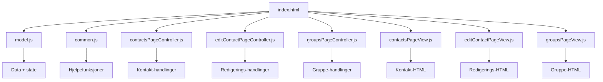

---

# 2. Det viktigste bildet

Hvis du bare skal huske ett diagram fra hele prosjektet, er dette det viktigste:

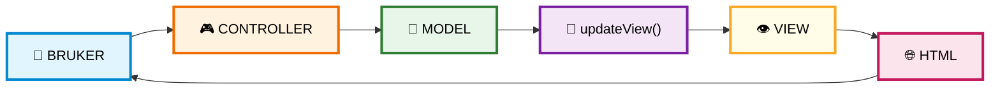

Det betyr:

```text
Brukeren gjør noe
       ↓
Controller reagerer
       ↓
Model endres
       ↓
updateView()
       ↓
View leser Model
       ↓
View lager HTML
       ↓
Brukeren ser resultatet
```

---

# 3. Hva slags arkitektur bruker appen?

Appen følger en MVC-lignende struktur.

```text
M = Model
V = View
C = Controller
```

## Model

Model inneholder dataene.

```text
model.js
```

## View

View viser dataene.

```text
contactsPageView.js
editContactPageView.js
groupsPageView.js
```

## Controller

Controller håndterer brukerhandlinger.

```text
contactsPageController.js
editContactPageController.js
groupsPageController.js
```

Dette kan tegnes slik:

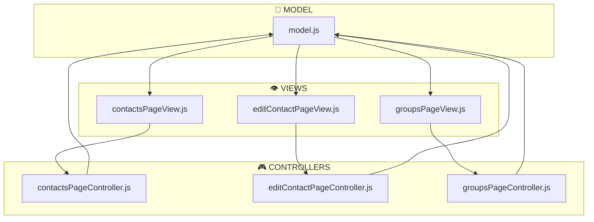

---

# 4. Filenes ansvar

| Fil | Ansvar |
|---|---|
| `index.html` | Starter applikasjonen og laster JS-filene |
| `model.js` | Inneholder all data og state |
| `common.js` | Felles hjelpefunksjoner |
| `contactsPageController.js` | Handlinger på kontaktsiden |
| `editContactPageController.js` | Opprette/redigere kontakter |
| `groupsPageController.js` | Handlinger for grupper |
| `contactsPageView.js` | Tegner kontaktsiden |
| `editContactPageView.js` | Tegner redigeringssiden |
| `groupsPageView.js` | Tegner gruppesiden |

---

# 5. `index.html`

`index.html` er inngangspunktet til hele applikasjonen.

Den inneholder:

```html
<body>

    <header>
        ...
    </header>

    <main id="app"></main>

    <footer>
        ...
    </footer>

    <script src="js/model.js"></script>
    <script src="js/common.js"></script>

    <script src="js/contactsPageController.js"></script>
    <script src="js/editContactPageController.js"></script>
    <script src="js/groupsPageController.js"></script>

    <script src="js/contactsPageView.js"></script>
    <script src="js/editContactPageView.js"></script>
    <script src="js/groupsPageView.js"></script>

</body>
```

Det betyr at nettleseren laster filene i denne rekkefølgen:

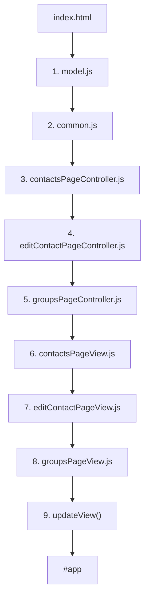

---

# 6. Hvorfor rekkefølgen på `<script>` er viktig

JavaScript-filer lastes inn i rekkefølgen de står i HTML-en.

For eksempel bruker View-funksjonene:

```javascript
getFilteredContacts()
```

og:

```javascript
escapeHtml()
```

Disse finnes i `common.js`.

Derfor må `common.js` lastes før View-filene.

På samme måte bruker Controllerne:

```javascript
model
```

Derfor må `model.js` være lastet først.

---

# 7. Avhengighetene mellom filene

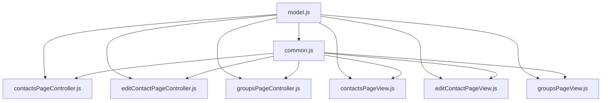

Forenklet:

```text
model.js
   │
   └──→ brukes av nesten alt

common.js
   │
   └──→ brukes av Controller og View

Controller
   │
   └──→ endrer Model

View
   │
   └──→ leser Model
```

---

# 8. `model.js`

`model.js` inneholder selve modellen.

```javascript
const model = {
    app: {
        currentPage: 'contactsPage',
    },

    viewState: {
        contactsPage: {
            searchText: '',
        },

        editContactPage: {
            contactId: null,
            name: '',
            phone: '',
            email: '',
            selectedGroupIds: [],
        },

        groupsPage: {
            newGroupName: '',
        },
    },

    contacts: [
        {
            id: 1,
            name: 'Terje',
            phone: '12345678',
            email: 'terje@example.com'
        },

        {
            id: 2,
            name: 'Per',
            phone: '87654321',
            email: 'per@example.com'
        },

        {
            id: 3,
            name: 'Pål',
            phone: '11223344',
            email: 'paal@example.com'
        },
    ],

    groups: [
        { id: 1, name: 'Sykling' },
        { id: 2, name: 'Konsert' },
        { id: 3, name: 'Reising' },
    ],

    memberships: [
        { contactId: 1, groupId: 1 },
        { contactId: 1, groupId: 3 },
        { contactId: 2, groupId: 2 },
    ],
};
```

---

# 9. Hvordan `model.js` er bygget opp

Modellen består av fem hoveddeler:

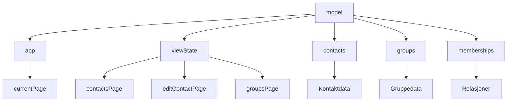

---

# 10. `model.app`

```javascript
app: {
    currentPage: 'contactsPage',
}
```

Dette forteller hvilken side som er aktiv.

Mulige verdier:

```text
contactsPage
editContactPage
groupsPage
```

Eksempel:

```javascript
model.app.currentPage = 'groupsPage';
```

betyr:

> Nå skal gruppesiden vises.

---

# 11. `viewState`

`viewState` inneholder midlertidige brukerdata.

```text
viewState
│
├── contactsPage
│   └── searchText
│
├── editContactPage
│   ├── contactId
│   ├── name
│   ├── phone
│   ├── email
│   └── selectedGroupIds
│
└── groupsPage
    └── newGroupName
```

Dette er viktig fordi `viewState` ikke nødvendigvis representerer lagrede data.

Det er brukerens arbeidsområde.

---

# 12. `contacts`

`contacts` inneholder de lagrede kontaktene.

```javascript
contacts: [
    {
        id: 1,
        name: 'Terje',
        phone: '12345678',
        email: 'terje@example.com'
    }
]
```

En kontakt har:

```text
id
name
phone
email
```

---

# 13. `groups`

`groups` inneholder gruppene.

```javascript
groups: [
    { id: 1, name: 'Sykling' },
    { id: 2, name: 'Konsert' },
    { id: 3, name: 'Reising' },
]
```

En gruppe har:

```text
id
name
```

---

# 14. `memberships`

`memberships` kobler kontakter og grupper.

```javascript
memberships: [
    { contactId: 1, groupId: 1 },
    { contactId: 1, groupId: 3 },
    { contactId: 2, groupId: 2 },
]
```

Dette betyr:

```text
Kontakt 1 → Gruppe 1
Kontakt 1 → Gruppe 3
Kontakt 2 → Gruppe 2
```

Dermed:

```text
Terje → Sykling
Terje → Reising
Per   → Konsert
```

---

# 15. Hele modellen visuelt

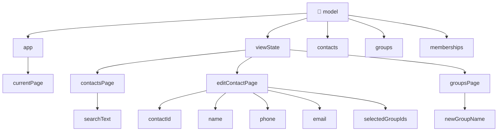

---

# 16. `common.js`

`common.js` inneholder funksjoner som brukes av flere andre filer.

Funksjonene er:

```text
findObjectById()
getNextId()
copyArray()
getGroupsForContact()
getContactsForGroup()
getFilteredContacts()
escapeHtml()
```

Diagram:

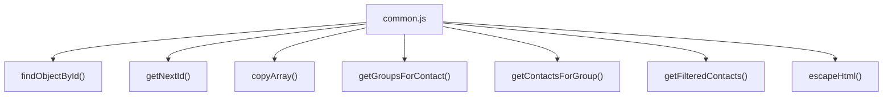

---

# 17. `findObjectById()`

```javascript
function findObjectById(array, id) {
    for (let object of array) {
        if (object.id === id) {
            return object;
        }
    }
    return null;
}
```

Funksjonen får:

```text
array
id
```

og leter etter et objekt med riktig ID.

---

# 18. Hvordan `findObjectById()` fungerer

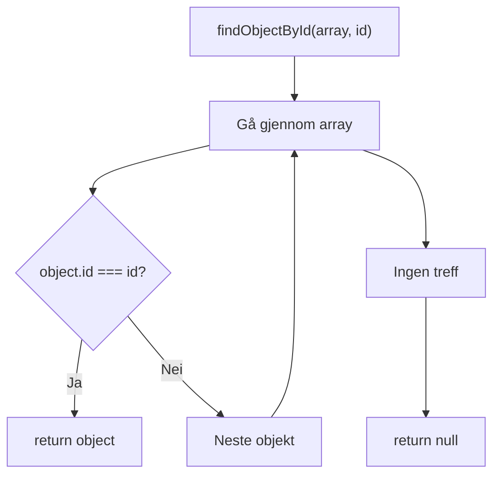

Eksempel:

```javascript
findObjectById(model.contacts, 2)
```

gir:

```javascript
{
    id: 2,
    name: 'Per',
    phone: '87654321',
    email: 'per@example.com'
}
```

---

# 19. Hvor brukes `findObjectById()`?

Funksjonen brukes blant annet i:

```text
startEditContact()
deleteContact()
getGroupsForContact()
getContactsForGroup()
```

Derfor er `common.js` en slags verktøykasse.

---

# 20. `getNextId()`

```javascript
function getNextId(array) {
    let highestId = 0;

    for (let object of array) {
        if (object.id > highestId) {
            highestId = object.id;
        }
    }

    return highestId + 1;
}
```

Funksjonen finner høyeste ID.

Hvis arrayen inneholder:

```text
1
2
3
```

blir:

```text
highestId = 3
```

og funksjonen returnerer:

```text
4
```

---

# 21. `copyArray()`

```javascript
function copyArray(array) {
    const result = [];

    for (let item of array) {
        result.push(item);
    }

    return result;
}
```

Den lager en ny array.

Eksempel:

```javascript
const newGroups = copyArray(model.groups);
```

Deretter kan man gjøre:

```javascript
newGroups.push(newGroup);
```

uten å bruke `push()` direkte på den gamle arrayen.

---

# 22. `getGroupsForContact()`

Denne funksjonen kobler:

```text
contactId
      ↓
memberships
      ↓
groupId
      ↓
groups
```

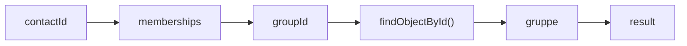

Funksjonen gjør altså et relasjonsoppslag.

---

# 23. `getContactsForGroup()`

Dette gjør det motsatte:

```text
groupId
    ↓
memberships
    ↓
contactId
    ↓
contacts
```

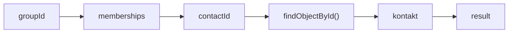

---

# 24. `getFilteredContacts()`

Denne funksjonen håndterer søk.

```javascript
const searchText =
    model.viewState.contactsPage.searchText
        .trim()
        .toLowerCase();
```

Deretter går den gjennom alle kontaktene.

Den sjekker:

```text
navn
telefon
e-post
```

---

# 25. Søkelogikken

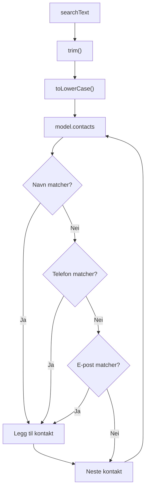

---

# 26. `escapeHtml()`

`escapeHtml()` beskytter HTML-en når brukerdata settes inn med `innerHTML`.

For eksempel:

```text
<test>
```

blir:

```text
&lt;test&gt;
```

Funksjonen håndterer:

```text
&
<
>
"
'
```

Dette er spesielt viktig fordi View-funksjonene bruker:

```javascript
innerHTML
```

---

# 27. `contactsPageController.js`

Denne filen håndterer handlinger knyttet til kontaktsiden.

Funksjoner:

```text
goToContactsPage()
deleteContact()
```

Den har altså et relativt lite ansvar.

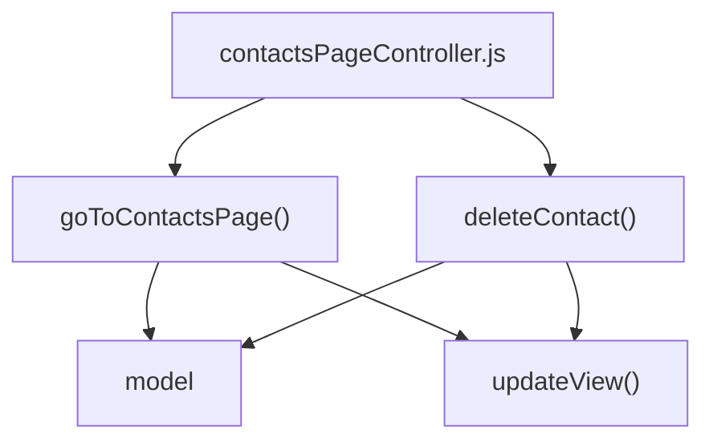

---

# 28. `goToContactsPage()`

```javascript
function goToContactsPage() {
    model.app.currentPage = 'contactsPage';
    updateView();
}
```

Funksjonen gjør to ting:

```text
1. Endrer currentPage
2. Tegner siden på nytt
```

Altså:

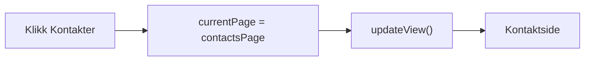

---

# 29. `deleteContact()`

Funksjonen får:

```javascript
contactId
```

først.

Så finner den kontakten:

```javascript
const contact =
    findObjectById(model.contacts, contactId);
```

Hvis den ikke finnes:

```javascript
if (contact == null) return;
```

---

# 30. Sletting av kontakt

Deretter finner den plasseringen:

```javascript
const index = model.contacts.indexOf(contact);
```

og sletter:

```javascript
model.contacts.splice(index, 1);
```

Deretter må medlemskapene også slettes.

Hvorfor?

Fordi kontakten ellers ville vært borte fra `contacts`, men fortsatt ligget i `memberships`.

---

# 31. Sletting av kontakt og memberships

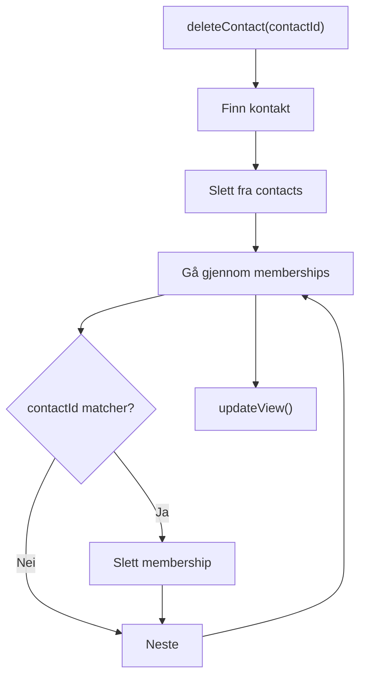

Dette viser hvorfor sletting må oppdatere to deler av modellen.

---

# 32. `editContactPageController.js`

Denne filen inneholder mesteparten av logikken for oppretting og redigering av kontakter.

Funksjonene er:

```text
clearEditContactViewState()
startNewContact()
startEditContact()
toggleGroupForEditedContact()
saveContact()
cancelEditContact()
```

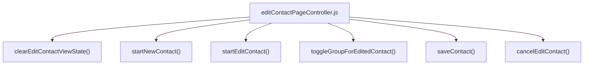

---

# 33. `clearEditContactViewState()`

Funksjonen tømmer arbeidsutkastet.

```javascript
function clearEditContactViewState() {
    const viewState =
        model.viewState.editContactPage;

    viewState.contactId = null;
    viewState.name = '';
    viewState.phone = '';
    viewState.email = '';
    viewState.selectedGroupIds = [];
}
```

Etter funksjonen:

```text
contactId = null
name = ''
phone = ''
email = ''
selectedGroupIds = []
```

---

# 34. Hvorfor trenger vi `clearEditContactViewState()`?

Tenk deg:

```text
Bruker redigerer Terje
        ↓
Bruker trykker Avbryt
        ↓
Bruker trykker Ny kontakt
```

Hvis vi ikke tømmer `viewState`, kan gamle data bli liggende.

Derfor:

```text
Ny kontakt
   ↓
Tøm arbeidsutkast
   ↓
Vis tomt skjema
```

---

# 35. `startNewContact()`

```javascript
function startNewContact() {
    clearEditContactViewState();

    model.app.currentPage =
        'editContactPage';

    updateView();
}
```

Flyten er:

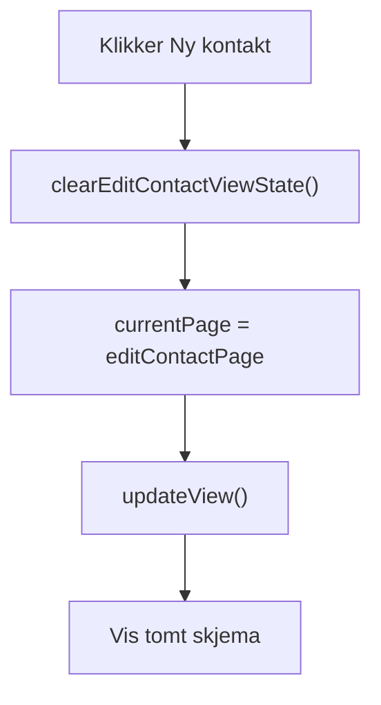

---

# 36. `startEditContact()`

Når brukeren klikker Rediger, må eksisterende data kopieres til `viewState`.

```javascript
function startEditContact(contactId) {
    const contact =
        findObjectById(model.contacts, contactId);

    if (contact === null) return;

    const viewState =
        model.viewState.editContactPage;

    viewState.contactId = contact.id;
    viewState.name = contact.name;
    viewState.phone = contact.phone;
    viewState.email = contact.email;

    ...
}
```

---

# 37. Hva skjer når vi redigerer?

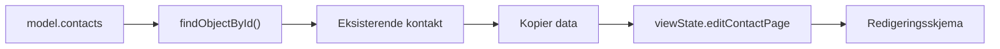

Den eksisterende kontakten endres altså ikke direkte.

---

# 38. Henting av gruppene ved redigering

`startEditContact()` går også gjennom memberships:

```javascript
for (let membership of model.memberships) {
    if (membership.contactId === contactId) {
        viewState.selectedGroupIds.push(
            membership.groupId
        );
    }
}
```

Dette betyr:

```text
Kontakt
   ↓
memberships
   ↓
groupId
   ↓
selectedGroupIds
```

---

# 39. `selectedGroupIds`

Hvis Terje er medlem av:

```text
Sykling = 1
Reising = 3
```

blir:

```javascript
selectedGroupIds = [1, 3]
```

Viewen kan da krysse av:

```text
☑ Sykling
☐ Konsert
☑ Reising
```

---

# 40. `toggleGroupForEditedContact()`

Denne funksjonen brukes når brukeren klikker på en checkbox.

Hvis ID-en allerede finnes:

```text
fjern den
```

Hvis ID-en ikke finnes:

```text
legg den til
```

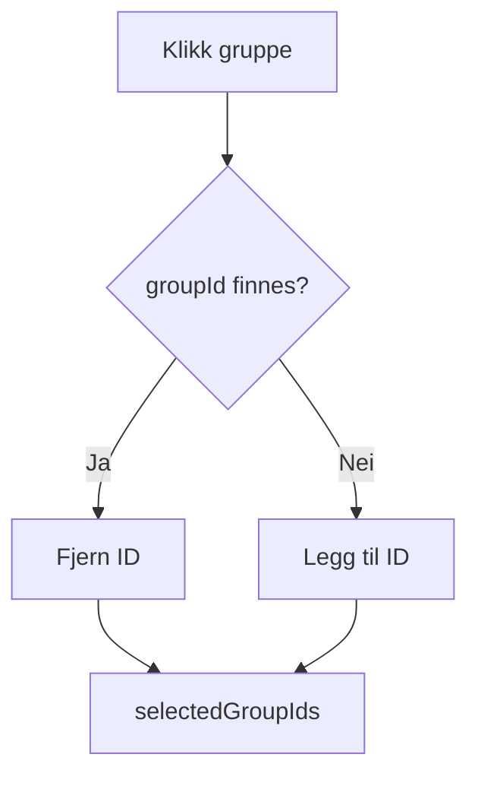

---

# 41. `saveContact()`

Dette er en av de viktigste funksjonene i hele applikasjonen.

Den gjør omtrent dette:

```text
1. Hent viewState
2. Valider navn
3. Finn eller lag ID
4. Lag updatedContact
5. Oppdater contacts
6. Oppdater memberships
7. Tøm viewState
8. Gå tilbake til kontaktsiden
9. updateView()
```

---

# 42. `saveContact()` steg for steg

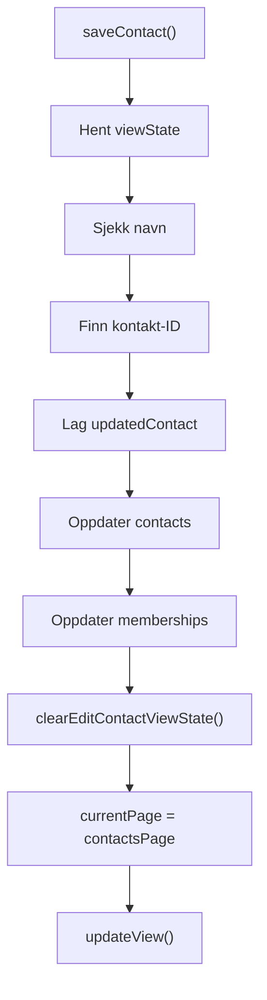

---

# 43. Ny kontakt versus eksisterende kontakt

Denne delen er viktig:

```javascript
let contactId = viewState.contactId;

if (contactId === null) {
    contactId = getNextId(model.contacts);
}
```

Hvis:

```text
contactId === null
```

er det en ny kontakt.

Hvis:

```text
contactId !== null
```

redigerer vi en eksisterende kontakt.

---

# 44. `updatedContact`

Deretter bygges et nytt objekt:

```javascript
const updatedContact = {
    id: contactId,
    name: viewState.name.trim(),
    phone: viewState.phone.trim(),
    email: viewState.email.trim(),
};
```

Dette betyr at `viewState` brukes som utgangspunkt for den nye lagrede kontakten.

---

# 45. Oppdatering av `contacts`

Koden bygger en ny array:

```javascript
const newContacts = [];

for (let contact of model.contacts) {
    if (contact.id === contactId) {
        newContacts.push(updatedContact);
    } else {
        newContacts.push(contact);
    }
}
```

Hvis kontakten er ny:

```javascript
if (viewState.contactId === null) {
    newContacts.push(updatedContact);
}
```

Til slutt:

```javascript
model.contacts = newContacts;
```

---

# 46. Hvorfor bygger vi `newContacts`?

Tenk:

```text
Gammel array
    ↓
[Terje, Per, Pål]
```

Hvis Terje redigeres:

```text
Ny array
    ↓
[Terje (oppdatert), Per, Pål]
```

Det gjør det tydelig at vi bygger en ny datastruktur.

---

# 47. Oppdatering av memberships

Først fjernes den aktuelle kontaktens gamle memberships.

```javascript
for (let membership of model.memberships) {
    if (membership.contactId !== contactId) {
        newMemberships.push(membership);
    }
}
```

Deretter legges de nye til:

```javascript
for (let groupId of viewState.selectedGroupIds) {
    newMemberships.push({
        contactId: contactId,
        groupId: groupId
    });
}
```

---

# 48. Membership-oppdateringen visuelt

```mermaid
flowchart TD

    OLD["Gamle memberships"]

    OLD --> KEEP["Behold andre kontakter"]

    OLD --> REMOVE["Fjern denne kontakten"]

    REMOVE --> SELECTED["selectedGroupIds"]

    SELECTED --> CREATE["Lag nye memberships"]

    KEEP --> COMBINE["newMemberships"]

    CREATE --> COMBINE

    COMBINE --> MODEL["model.memberships"]
```

---

# 49. `cancelEditContact()`

```javascript
function cancelEditContact() {
    clearEditContactViewState();

    model.app.currentPage =
        'contactsPage';

    updateView();
}
```

Her skjer det ingen endring av `model.contacts`.

Det betyr:

```text
Redigering
   ↓
viewState endres
   ↓
Avbryt
   ↓
viewState slettes
   ↓
model.contacts er fortsatt uendret
```

---

# 50. `groupsPageController.js`

Denne filen håndterer gruppe-relaterte handlinger.

Funksjonene er:

```text
goToGroupsPage()
createGroup()
```

```mermaid
flowchart TD

    FILE["groupsPageController.js"]

    FILE --> NAV["goToGroupsPage()"]

    FILE --> CREATE["createGroup()"]

    NAV --> MODEL["model"]

    CREATE --> MODEL

    NAV --> UPDATE["updateView()"]

    CREATE --> UPDATE
```

---

# 51. `goToGroupsPage()`

```javascript
function goToGroupsPage() {
    clearEditContactViewState();

    model.app.currentPage =
        'groupsPage';

    updateView();
}
```

Den:

1. rydder redigeringsstate
2. setter riktig side
3. tegner siden på nytt

---

# 52. `createGroup()`

Denne funksjonen:

```text
1. Leser gruppenavnet
2. Fjerner mellomrom med trim()
3. Avbryter hvis navnet er tomt
4. Finner ny ID
5. Lager gruppeobjekt
6. Kopierer gruppelisten
7. Legger gruppen til
8. Oppdaterer model
9. Tømmer input
10. Oppdaterer View
```

---

# 53. `createGroup()` visuelt

```mermaid
flowchart TD

    START["createGroup()"]

    START --> STATE["viewState.groupsPage"]

    STATE --> NAME["newGroupName"]

    NAME --> TRIM["trim()"]

    TRIM --> EMPTY{"Tomt?"}

    EMPTY -->|Ja| STOP["return"]

    EMPTY -->|Nei| ID["getNextId()"]

    ID --> GROUP["newGroup"]

    GROUP --> COPY["copyArray()"]

    COPY --> PUSH["push(newGroup)"]

    PUSH --> MODEL["model.groups"]

    MODEL --> CLEAR["Tøm newGroupName"]

    CLEAR --> UPDATE["updateView()"]
```

---

# 54. `contactsPageView.js`

Denne filen har ansvar for å vise kontaktsiden.

Funksjonene er:

```text
updateViewContactsPage()
createContactsHtml()
createContactHtml()
```

```mermaid
flowchart TD

    FILE["contactsPageView.js"]

    FILE --> PAGE["updateViewContactsPage()"]

    PAGE --> LIST["createContactsHtml()"]

    LIST --> CARD["createContactHtml()"]

    CARD --> GROUPS["getGroupsForContact()"]

    CARD --> ESCAPE["escapeHtml()"]
```

---

# 55. `updateViewContactsPage()`

Dette er hovedfunksjonen for kontaktsiden.

Den gjør blant annet:

```javascript
const viewState =
    model.viewState.contactsPage;

const contacts =
    getFilteredContacts();
```

Deretter bygger den HTML.

---

# 56. Kontaktsiden visuelt

```mermaid
flowchart TD

    PAGE["updateViewContactsPage()"]

    PAGE --> STATE["Les viewState"]

    PAGE --> FILTER["getFilteredContacts()"]

    FILTER --> CONTACTS["Filtrerte kontakter"]

    CONTACTS --> CREATE["createContactsHtml()"]

    CREATE --> CARD["createContactHtml()"]

    CARD --> HTML["Kontaktkort"]

    HTML --> APP["document.getElementById('app')"]

    APP --> SCREEN["🖥️ Skjerm"]
```

---

# 57. Hvorfor kaller View `getFilteredContacts()`?

Viewen trenger ikke vite hvordan søket fungerer.

Den spør bare:

```javascript
getFilteredContacts()
```

og får tilbake:

```text
kontakter som skal vises
```

Dermed ligger selve søkelogikken i `common.js`.

Dette er en viktig separasjon av ansvar.

---

# 58. `createContactsHtml()`

Denne funksjonen lager HTML for alle kontaktene.

Hvis det ikke finnes kontakter:

```javascript
if (contacts.length === 0) {
    return '...';
}
```

Hvis det finnes kontakter:

```javascript
for (let contact of contacts) {
    html += createContactHtml(contact);
}
```

---

# 59. `createContactHtml()`

Denne funksjonen lager ett kontaktkort.

Den bruker:

```javascript
getGroupsForContact(contact.id)
```

for å finne gruppene.

Deretter bygges:

```html
<article class="card">
    ...
</article>
```

---

# 60. Hvordan ett kontaktkort bygges

```mermaid
flowchart TD

    CONTACT["contact"]

    CONTACT --> NAME["contact.name"]

    CONTACT --> PHONE["contact.phone"]

    CONTACT --> EMAIL["contact.email"]

    CONTACT --> ID["contact.id"]

    ID --> GROUPS["getGroupsForContact()"]

    NAME --> ESCAPE["escapeHtml()"]
    PHONE --> ESCAPE
    EMAIL --> ESCAPE

    GROUPS --> GROUP_NAMES["Gruppenavn"]

    GROUP_NAMES --> HTML["Kontaktkort"]

    ESCAPE --> HTML
```

---

# 61. `editContactPageView.js`

Denne filen viser redigeringsskjemaet.

Funksjonene er:

```text
updateViewEditContactPage()
createGroupCheckboxesHtml()
createGroupCheckboxHtml()
```

```mermaid
flowchart TD

    FILE["editContactPageView.js"]

    FILE --> PAGE["updateViewEditContactPage()"]

    PAGE --> CHECKBOXES["createGroupCheckboxesHtml()"]

    CHECKBOXES --> CHECKBOX["createGroupCheckboxHtml()"]

    CHECKBOX --> MODEL["model.viewState"]
```

---

# 62. `updateViewEditContactPage()`

Denne funksjonen leser:

```javascript
model.viewState.editContactPage
```

og bestemmer overskriften.

Hvis:

```javascript
viewState.contactId === null
```

blir:

```text
Ny kontakt
```

ellers:

```text
Rediger kontakt
```

---

# 63. Redigeringsskjemaet

```mermaid
flowchart TD

    VIEW["updateViewEditContactPage()"]

    VIEW --> HEADING["Overskrift"]

    VIEW --> NAME["Navn-input"]

    VIEW --> PHONE["Telefon-input"]

    VIEW --> EMAIL["E-post-input"]

    VIEW --> GROUPS["Gruppe-checkboxer"]

    VIEW --> SAVE["Lagre"]

    VIEW --> CANCEL["Avbryt"]

    NAME --> STATE["viewState"]

    PHONE --> STATE

    EMAIL --> STATE

    GROUPS --> STATE
```

---

# 64. Input-feltene endrer `viewState`

For eksempel:

```html
oninput="
    model.viewState.editContactPage.name =
    this.value
"
```

Det betyr:

```text
Bruker skriver
      ↓
this.value
      ↓
viewState.name
```

Men:

```text
model.contacts
```

endres ikke.

---

# 65. Checkboxene

`createGroupCheckboxesHtml()` går gjennom alle grupper.

```javascript
for (let group of model.groups) {
    html += createGroupCheckboxHtml(group);
}
```

Derfor blir det én checkbox per gruppe.

---

# 66. `createGroupCheckboxHtml()`

Funksjonen sjekker:

```javascript
model.viewState.editContactPage
    .selectedGroupIds
    .includes(group.id)
```

Hvis ID-en finnes:

```javascript
checked = 'checked';
```

Dermed vet HTML-en hvilke grupper som skal være avkrysset.

---

# 67. `groupsPageView.js`

Denne filen viser gruppesiden.

Funksjonene er:

```text
updateViewGroupsPage()
createGroupsHtml()
createGroupHtml()
createGroupMembersHtml()
```

```mermaid
flowchart TD

    FILE["groupsPageView.js"]

    FILE --> PAGE["updateViewGroupsPage()"]

    PAGE --> GROUPS["createGroupsHtml()"]

    GROUPS --> GROUP["createGroupHtml()"]

    GROUP --> MEMBERS["createGroupMembersHtml()"]

    GROUP --> LOOKUP["getContactsForGroup()"]

    MEMBERS --> HTML["HTML"]
```

---

# 68. `updateViewGroupsPage()`

Hovedansvaret er:

```text
Vis overskrift
Vis input for ny gruppe
Vis knapp
Vis eksisterende grupper
```

Den kaller:

```javascript
createGroupsHtml()
```

for å vise gruppene.

---

# 69. `createGroupsHtml()`

Denne går gjennom:

```javascript
model.groups
```

og lager HTML for hver gruppe.

```javascript
for (let group of model.groups) {
    html += createGroupHtml(group);
}
```

---

# 70. `createGroupHtml()`

Her skjer noe viktig:

```javascript
const contacts =
    getContactsForGroup(group.id);
```

Gruppen har ikke en egen kontaktliste.

I stedet beregnes medlemmene.

```mermaid
flowchart LR

    GROUP["group"]

    GROUP --> ID["group.id"]

    ID --> LOOKUP["getContactsForGroup()"]

    LOOKUP --> MEMBERS["Kontakter"]

    MEMBERS --> HTML["Gruppekort"]
```

---

# 71. `createGroupMembersHtml()`

Hvis gruppen ikke har medlemmer:

```text
Ingen medlemmer
```

Hvis den har medlemmer:

```javascript
for (let contact of contacts) {
    html += `<li>${escapeHtml(contact.name)}</li>`;
}
```

Resultatet blir:

```html
<ul>
    <li>Terje</li>
    <li>Per</li>
</ul>
```

---

# 72. `updateView()` – limet mellom alt

`updateView()` ligger direkte i `index.html`.

```javascript
function updateView() {
    if (model.app.currentPage === 'contactsPage') {
        updateViewContactsPage();
    }
    else if (model.app.currentPage === 'editContactPage') {
        updateViewEditContactPage();
    }
    else if (model.app.currentPage === 'groupsPage') {
        updateViewGroupsPage();
    }
}
```

Dette er koblingen mellom:

```text
Controller
      ↓
currentPage
      ↓
updateView()
      ↓
riktig View
```

---

# 73. `updateView()` som router

```mermaid
flowchart TD

    UPDATE["updateView()"]

    UPDATE --> CHECK1{"contactsPage?"}

    CHECK1 -->|Ja| CONTACTS["updateViewContactsPage()"]

    CHECK1 -->|Nei| CHECK2{"editContactPage?"}

    CHECK2 -->|Ja| EDIT["updateViewEditContactPage()"]

    CHECK2 -->|Nei| CHECK3{"groupsPage?"}

    CHECK3 -->|Ja| GROUPS["updateViewGroupsPage()"]
```

Det er derfor vi kan kalle:

```javascript
updateView();
```

fra mange forskjellige steder.

Funksjonen finner selv ut hvilken View som skal vises.

---

# 74. Den komplette filstrukturen

```mermaid
flowchart TB

    INDEX["📄 index.html"]

    MODEL["🧠 model.js"]
    COMMON["🔧 common.js"]

    CC["🎮 contactsPageController.js"]
    EC["🎮 editContactPageController.js"]
    GC["🎮 groupsPageController.js"]

    CV["👁️ contactsPageView.js"]
    EV["👁️ editContactPageView.js"]
    GV["👁️ groupsPageView.js"]

    INDEX --> MODEL
    INDEX --> COMMON

    INDEX --> CC
    INDEX --> EC
    INDEX --> GC

    INDEX --> CV
    INDEX --> EV
    INDEX --> GV

    MODEL --> CC
    MODEL --> EC
    MODEL --> GC

    MODEL --> CV
    MODEL --> EV
    MODEL --> GV

    COMMON --> CC
    COMMON --> EC
    COMMON --> GC

    COMMON --> CV
    COMMON --> EV
    COMMON --> GV

    CC --> UPDATE["🔄 updateView()"]
    EC --> UPDATE
    GC --> UPDATE

    UPDATE --> CV
    UPDATE --> EV
    UPDATE --> GV
```

---

# 75. Hvilken fil gjør hva?

```text
┌─────────────────────────────────────────┐
│ model.js                                │
│                                         │
│ "Hva finnes i appen?"                   │
│                                         │
│ contacts                                │
│ groups                                  │
│ memberships                             │
│ viewState                               │
│ currentPage                             │
└─────────────────────────────────────────┘


┌─────────────────────────────────────────┐
│ common.js                               │
│                                         │
│ "Hvordan finner/beregner vi ting?"      │
│                                         │
│ findObjectById()                        │
│ getNextId()                             │
│ copyArray()                             │
│ getGroupsForContact()                   │
│ getContactsForGroup()                   │
│ getFilteredContacts()                   │
│ escapeHtml()                            │
└─────────────────────────────────────────┘


┌─────────────────────────────────────────┐
│ Controller-filer                        │
│                                         │
│ "Hva skal skje når brukeren gjør noe?"  │
│                                         │
│ save                                    │
│ delete                                  │
│ create                                  │
│ navigate                                │
│ edit                                    │
└─────────────────────────────────────────┘


┌─────────────────────────────────────────┐
│ View-filer                              │
│                                         │
│ "Hvordan skal det se ut?"               │
│                                         │
│ bygger HTML                             │
│ leser model                             │
│ viser data                              │
└─────────────────────────────────────────┘
```

---

# 76. Eksempel: Brukeren klikker "Rediger"

Dette er et godt eksempel på hvordan flere filer samarbeider.

Brukeren ser et kontaktkort.

HTML-en inneholder:

```html
<button onclick="startEditContact(1)">
    Rediger
</button>
```

---

# 77. Steg 1 – HTML kaller Controller

Klikket fører til:

```javascript
startEditContact(1)
```

Denne funksjonen ligger i:

```text
editContactPageController.js
```

---

# 78. Steg 2 – Controller bruker Model

Controlleren gjør:

```javascript
const contact =
    findObjectById(model.contacts, contactId);
```

Her brukes:

```text
editContactPageController.js
          ↓
common.js
          ↓
model.js
```

---

# 79. Steg 3 – Controller kopierer data

Controlleren gjør:

```javascript
viewState.name = contact.name;
viewState.phone = contact.phone;
viewState.email = contact.email;
```

Data går:

```text
model.contacts
      ↓
viewState.editContactPage
```

---

# 80. Steg 4 – Controller bytter side

```javascript
model.app.currentPage =
    'editContactPage';
```

Dette forteller appen:

> Nå skal redigeringssiden vises.

---

# 81. Steg 5 – Controller kaller `updateView()`

```javascript
updateView();
```

`updateView()` ser:

```javascript
model.app.currentPage
```

og finner:

```text
editContactPage
```

---

# 82. Steg 6 – `updateView()` kaller View

Den gjør:

```javascript
updateViewEditContactPage();
```

Denne funksjonen ligger i:

```text
editContactPageView.js
```

---

# 83. Steg 7 – View bygger HTML

Viewen leser:

```text
viewState.name
viewState.phone
viewState.email
selectedGroupIds
```

og bygger skjemaet.

---

# 84. Hele "Rediger"-flyten

```mermaid
sequenceDiagram

    actor User

    participant HTML as index.html
    participant Controller as editContactPageController.js
    participant Common as common.js
    participant Model as model.js
    participant Router as updateView()
    participant View as editContactPageView.js

    User->>HTML: Klikker Rediger

    HTML->>Controller: startEditContact(1)

    Controller->>Common: findObjectById()

    Common->>Model: Les contacts

    Model-->>Common: Kontakt

    Common-->>Controller: Kontakt

    Controller->>Model: Kopier til viewState

    Controller->>Model: currentPage = editContactPage

    Controller->>Router: updateView()

    Router->>Model: Les currentPage

    Router->>View: updateViewEditContactPage()

    View->>Model: Les viewState

    View-->>HTML: Bygg redigeringsskjema

    HTML-->>User: Viser skjema
```

---

# 85. Eksempel: Brukeren trykker "Lagre"

Nå går vi motsatt vei.

```text
Brukeren
   ↓
Lagre-knapp
   ↓
saveContact()
   ↓
viewState
   ↓
contacts
   ↓
memberships
   ↓
updateView()
   ↓
contactsPageView.js
```

---

# 86. Komplett "Lagre"-flyt

```mermaid
sequenceDiagram

    actor User

    participant View as editContactPageView.js
    participant Controller as editContactPageController.js
    participant Common as common.js
    participant Model as model.js
    participant Router as updateView()
    participant ContactView as contactsPageView.js

    User->>View: Klikker Lagre

    View->>Controller: saveContact()

    Controller->>Model: Les viewState

    Controller->>Common: getNextId() hvis ny kontakt

    Common-->>Controller: Ny ID

    Controller->>Model: Lag updatedContact

    Controller->>Model: Oppdater contacts

    Controller->>Model: Oppdater memberships

    Controller->>Model: currentPage = contactsPage

    Controller->>Model: clearEditContactViewState()

    Controller->>Router: updateView()

    Router->>ContactView: updateViewContactsPage()

    ContactView->>Common: getFilteredContacts()

    Common->>Model: Les contacts

    Model-->>Common: Kontakter

    Common-->>ContactView: Filtrerte kontakter

    ContactView-->>User: Viser oppdatert kontaktliste
```

---

# 87. Eksempel: Brukeren søker

Når brukeren skriver i søkefeltet:

```html
oninput="
    model.viewState.contactsPage.searchText =
    this.value
"
```

Det betyr:

```text
Bruker skriver
      ↓
viewState.searchText endres
```

Men listen oppdateres ikke før:

```text
Filtrer
```

trykkes.

---

# 88. Søkeflyt mellom filer

```mermaid
flowchart LR

    USER["👤 Bruker"]

    USER --> INPUT["input i contactsPageView.js"]

    INPUT --> STATE["model.viewState.contactsPage.searchText"]

    USER --> FILTER["Klikker Filtrer"]

    FILTER --> UPDATE["updateView()"]

    UPDATE --> VIEW["updateViewContactsPage()"]

    VIEW --> COMMON["getFilteredContacts()"]

    COMMON --> MODEL["model.contacts"]

    MODEL --> COMMON

    COMMON --> VIEW

    VIEW --> HTML["Ny HTML"]

    HTML --> USER
```

---

# 89. Eksempel: Brukeren oppretter gruppe

```text
Bruker
   ↓
groupsPageView.js
   ↓
createGroup()
   ↓
groupsPageController.js
   ↓
getNextId()
   ↓
common.js
   ↓
model.groups
   ↓
updateView()
   ↓
groupsPageView.js
```

---

# 90. Komplett "Opprett gruppe"-flyt

```mermaid
sequenceDiagram

    actor User

    participant View as groupsPageView.js
    participant Controller as groupsPageController.js
    participant Common as common.js
    participant Model as model.js
    participant Router as updateView()

    User->>View: Skriver gruppenavn

    View->>Model: newGroupName = value

    User->>View: Klikker Opprett gruppe

    View->>Controller: createGroup()

    Controller->>Model: Les newGroupName

    Controller->>Common: getNextId(model.groups)

    Common-->>Controller: Ny ID

    Controller->>Common: copyArray(model.groups)

    Common-->>Controller: Ny array

    Controller->>Model: push(newGroup)

    Controller->>Model: groups = newGroups

    Controller->>Model: Tøm newGroupName

    Controller->>Router: updateView()

    Router->>View: updateViewGroupsPage()

    View-->>User: Viser ny gruppe
```

---

# 91. Eksempel: Brukeren sletter kontakt

```text
Bruker
   ↓
contactsPageView.js
   ↓
deleteContact(id)
   ↓
contactsPageController.js
   ↓
findObjectById()
   ↓
common.js
   ↓
model.contacts
   ↓
slett kontakt
   ↓
model.memberships
   ↓
slett relasjoner
   ↓
updateView()
   ↓
contactsPageView.js
```

---

# 92. Hvorfor er `common.js` viktig?

Uten `common.js` måtte flere filer inneholde samme logikk.

For eksempel kunne både:

```text
contactsPageController.js
groupsPageController.js
contactsPageView.js
groupsPageView.js
```

trengt:

```javascript
findObjectById()
```

I stedet har vi én funksjon:

```text
common.js
    ↓
findObjectById()
```

som alle kan bruke.

---

# 93. `common.js` som verktøykasse

```mermaid
flowchart TB

    COMMON["🔧 common.js"]

    COMMON --> FIND["Finn objekt"]
    COMMON --> ID["Finn neste ID"]
    COMMON --> COPY["Kopier array"]
    COMMON --> RELATION1["Kontakt → grupper"]
    COMMON --> RELATION2["Gruppe → kontakter"]
    COMMON --> SEARCH["Filtrer kontakter"]
    COMMON --> SECURITY["Escape HTML"]

    FIND --> ALL["Brukes av resten av appen"]
    ID --> ALL
    COPY --> ALL
    RELATION1 --> ALL
    RELATION2 --> ALL
    SEARCH --> ALL
    SECURITY --> ALL
```

---

# 94. Hvordan View og Controller samarbeider

View og Controller har forskjellige roller.

## View

View sier:

> Her er en knapp.

Eksempel:

```html
<button onclick="deleteContact(1)">
    Slett
</button>
```

## Controller

Controller sier:

> Når knappen trykkes, skal kontakten slettes.

```javascript
function deleteContact(contactId) {
    ...
}
```

---

# 95. View skal ikke gjøre modellendringer direkte

Et viktig prinsipp er:

```text
View
  ↓
viser informasjon
```

mens:

```text
Controller
  ↓
endrer data
```

Det finnes noen steder hvor HTML-eventet direkte endrer `viewState`, for eksempel:

```html
oninput="
    model.viewState.contactsPage.searchText =
    this.value
"
```

Dette fungerer fordi `viewState` representerer midlertidig input.

Den faktiske domenedataen oppdateres først gjennom Controlleren.

---

# 96. Model → View

View-funksjonene leser modellen.

Eksempel:

```javascript
for (let contact of model.contacts) {
    ...
}
```

eller:

```javascript
model.groups
```

eller:

```javascript
model.viewState.editContactPage
```

Viewen bruker dataene til å bygge HTML.

---

# 97. View → HTML

Eksempel:

```javascript
document.getElementById('app').innerHTML = `
    <h1>Kontakter</h1>
`;
```

Det betyr:

```text
JavaScript
    ↓
HTML-string
    ↓
#app
    ↓
nettleseren viser HTML
```

---

# 98. `#app`

I `index.html` finnes:

```html
<main id="app"></main>
```

Dette er området hvor sidene bygges.

Kontaktsiden:

```text
#app
   ↓
Kontaktside
```

Redigeringssiden:

```text
#app
   ↓
Redigeringsside
```

Gruppesiden:

```text
#app
   ↓
Gruppeside
```

---

# 99. Appen bruker ikke flere HTML-sider

Det finnes ikke:

```text
contacts.html
groups.html
edit.html
```

I stedet finnes:

```text
index.html
```

og innholdet i:

```html
<main id="app"></main>
```

byttes dynamisk.

Dette er grunnen til at:

```javascript
updateView()
```

er så viktig.

---

# 100. Navigasjon mellom sidene

```mermaid
stateDiagram-v2

    [*] --> contactsPage

    contactsPage --> editContactPage : startNewContact()

    contactsPage --> editContactPage : startEditContact()

    editContactPage --> contactsPage : saveContact()

    editContactPage --> contactsPage : cancelEditContact()

    contactsPage --> groupsPage : goToGroupsPage()

    groupsPage --> contactsPage : goToContactsPage()
```

---

# 101. Hva skjer når siden starter?

Nederst i `index.html` står:

```javascript
updateView();
```

Dette betyr at appen tegner den første siden med én gang.

Modellen starter med:

```javascript
currentPage: 'contactsPage'
```

Dermed:

```mermaid
flowchart TD

    START["Nettleseren laster index.html"]

    START --> SCRIPTS["JavaScript-filene lastes"]

    SCRIPTS --> MODEL["model.currentPage = contactsPage"]

    MODEL --> UPDATE["updateView()"]

    UPDATE --> CONTACTS["updateViewContactsPage()"]

    CONTACTS --> HTML["Kontaktsiden bygges"]

    HTML --> APP["#app"]

    APP --> SCREEN["👤 Brukeren ser Kontakter"]
```

---

# 102. Hele oppstarten

Rekkefølgen er:

```text
index.html
    ↓
model.js
    ↓
common.js
    ↓
controllers
    ↓
views
    ↓
updateView()
    ↓
currentPage
    ↓
riktig View
    ↓
#app
```

---

# 103. En viktig forskjell: lagrede data vs arbeidsdata

Dette er kanskje et av de viktigste konseptene i hele appen.

```mermaid
flowchart LR

    STORED["🧠 Lagrede data"]

    STORED --> CONTACTS["model.contacts"]

    STORED --> GROUPS["model.groups"]

    STORED --> MEMBERSHIPS["model.memberships"]

    DRAFT["✏️ Arbeidsdata"]

    DRAFT --> VIEWSTATE["model.viewState"]

    VIEWSTATE --> FORM["Redigeringsskjema"]
```

Lagrede data:

```text
contacts
groups
memberships
```

Arbeidsdata:

```text
viewState
```

---

# 104. Eksempel på forskjellen

Før redigering:

```text
model.contacts

Terje
Telefon: 12345678
```

Brukeren endrer telefonnummeret til:

```text
99999999
```

Da blir:

```text
viewState.phone = "99999999"
```

mens:

```text
model.contacts
```

fortsatt har:

```text
12345678
```

Først når brukeren trykker:

```text
Lagre
```

oppdateres modellen.

---

# 105. Hele redigeringskonseptet

```mermaid
flowchart TD

    STORED["Lagret kontakt"]

    STORED --> COPY["Kopier"]

    COPY --> DRAFT["viewState"]

    DRAFT --> EDIT["Brukeren redigerer"]

    EDIT --> DECISION{"Lagre eller Avbryt?"}

    DECISION -->|Lagre| SAVE["Controller oppdaterer Model"]

    DECISION -->|Avbryt| DISCARD["Forkast viewState"]

    SAVE --> STORED

    DISCARD --> END["Tilbake uten endring"]
```

---

# 106. Relasjoner er også beregnede data

`groups` inneholder:

```text
Sykling
Konsert
Reising
```

`contacts` inneholder:

```text
Terje
Per
Pål
```

Men ingen av dem inneholder en direkte liste over hverandre.

I stedet:

```text
memberships
```

kobler dem sammen.

---

# 107. Kontakt → gruppe

```mermaid
flowchart LR

    CONTACT["Terje<br>ID 1"]

    CONTACT --> M1["contactId 1<br>groupId 1"]

    CONTACT --> M2["contactId 1<br>groupId 3"]

    M1 --> GROUP1["Sykling<br>ID 1"]

    M2 --> GROUP3["Reising<br>ID 3"]
```

Dette beregnes av:

```javascript
getGroupsForContact(1)
```

---

# 108. Gruppe → kontakt

Motsatt:

```mermaid
flowchart LR

    GROUP["Sykling<br>ID 1"]

    GROUP --> M["contactId 1<br>groupId 1"]

    M --> CONTACT["Terje<br>ID 1"]
```

Dette beregnes av:

```javascript
getContactsForGroup(1)
```

---

# 109. Hvorfor er dette nyttig?

Hvis gruppen heter:

```text
Sykling
```

og navnet senere endres til:

```text
Sykkelklubben
```

trenger vi bare å endre:

```javascript
model.groups
```

Vi trenger ikke oppdatere alle kontakter.

Relasjonen bruker bare:

```text
groupId
```

---

# 110. Den komplette arkitekturen

```mermaid
flowchart TB

    USER["👤 BRUKER"]

    subgraph HTML["🌐 index.html"]

        APP["#app"]

        NAV["Navigasjon"]

        UPDATE["updateView()"]

    end

    subgraph CONTROLLERS["🎮 CONTROLLERS"]

        CC["contactsPageController.js"]

        EC["editContactPageController.js"]

        GC["groupsPageController.js"]

    end

    subgraph MODEL["🧠 MODEL"]

        M["model.js"]

        CONTACTS["contacts"]

        GROUPS["groups"]

        MEMBERSHIPS["memberships"]

        STATE["viewState"]

        PAGE["currentPage"]

    end

    subgraph COMMON["🔧 COMMON"]

        FIND["findObjectById()"]

        NEXT["getNextId()"]

        COPY["copyArray()"]

        REL1["getGroupsForContact()"]

        REL2["getContactsForGroup()"]

        FILTER["getFilteredContacts()"]

        ESCAPE["escapeHtml()"]

    end

    subgraph VIEWS["👁️ VIEWS"]

        CV["contactsPageView.js"]

        EV["editContactPageView.js"]

        GV["groupsPageView.js"]

    end

    USER --> NAV

    NAV --> CC
    NAV --> EC
    NAV --> GC

    CC --> M
    EC --> M
    GC --> M

    CC --> COMMON
    EC --> COMMON
    GC --> COMMON

    M --> CONTACTS
    M --> GROUPS
    M --> MEMBERSHIPS
    M --> STATE
    M --> PAGE

    COMMON --> CONTACTS
    COMMON --> GROUPS
    COMMON --> MEMBERSHIPS

    CC --> UPDATE
    EC --> UPDATE
    GC --> UPDATE

    UPDATE --> PAGE

    PAGE --> CV
    PAGE --> EV
    PAGE --> GV

    CV --> M
    EV --> M
    GV --> M

    CV --> ESCAPE
    EV --> ESCAPE
    GV --> ESCAPE

    CV --> APP
    EV --> APP
    GV --> APP

    APP --> USER
```

---

# 111. Hele appen forklart med én setning

Hele applikasjonen kan egentlig oppsummeres slik:

> **Brukeren gjør noe → Controlleren håndterer det → Model oppdateres → `updateView()` velger riktig View → View leser Model → HTML bygges → brukeren ser resultatet.**

---

# 112. Hvis du skal lese koden fra bunnen av

En god måte å forstå prosjektet på er å lese filene i denne rekkefølgen:

```text
1. index.html
       ↓
2. model.js
       ↓
3. common.js
       ↓
4. contactsPageController.js
       ↓
5. editContactPageController.js
       ↓
6. groupsPageController.js
       ↓
7. contactsPageView.js
       ↓
8. editContactPageView.js
       ↓
9. groupsPageView.js
```

Men enda viktigere er å forstå **flyten**:

```text
MODEL
  ↓
COMMON
  ↓
CONTROLLER
  ↓
updateView()
  ↓
VIEW
  ↓
HTML
```

---

# 113. Funksjonskart

## Model

```text
model
│
├── app
│   └── currentPage
│
├── viewState
│   ├── contactsPage
│   │   └── searchText
│   │
│   ├── editContactPage
│   │   ├── contactId
│   │   ├── name
│   │   ├── phone
│   │   ├── email
│   │   └── selectedGroupIds
│   │
│   └── groupsPage
│       └── newGroupName
│
├── contacts
├── groups
└── memberships
```

---

# 114. Common

```text
common.js
│
├── findObjectById()
│
├── getNextId()
│
├── copyArray()
│
├── getGroupsForContact()
│
├── getContactsForGroup()
│
├── getFilteredContacts()
│
└── escapeHtml()
```

---

# 115. Controllers

```text
contactsPageController.js
│
├── goToContactsPage()
└── deleteContact()


editContactPageController.js
│
├── clearEditContactViewState()
├── startNewContact()
├── startEditContact()
├── toggleGroupForEditedContact()
├── saveContact()
└── cancelEditContact()


groupsPageController.js
│
├── goToGroupsPage()
└── createGroup()
```

---

# 116. Views

```text
contactsPageView.js
│
├── updateViewContactsPage()
├── createContactsHtml()
└── createContactHtml()


editContactPageView.js
│
├── updateViewEditContactPage()
├── createGroupCheckboxesHtml()
└── createGroupCheckboxHtml()


groupsPageView.js
│
├── updateViewGroupsPage()
├── createGroupsHtml()
├── createGroupHtml()
└── createGroupMembersHtml()
```

---

# 117. Funksjoner som kobler flere filer sammen

Noen funksjoner er spesielt viktige fordi de binder hele arkitekturen sammen.

## `model`

Brukes nesten overalt.

## `updateView()`

Kobler Controller til View.

## `findObjectById()`

Kobler Controller/Helper til Model.

## `getGroupsForContact()`

Kobler kontaktdata med gruppedata.

## `getContactsForGroup()`

Kobler gruppedata med kontaktdata.

## `getFilteredContacts()`

Kobler søk/state med View.

## `escapeHtml()`

Kobler brukerdata med HTML.

---

# 118. De viktigste koblingene

```mermaid
flowchart LR

    MODEL["model.js"]

    COMMON["common.js"]

    CONTROLLER["Controller"]

    UPDATE["updateView()"]

    VIEW["View"]

    HTML["HTML"]

    MODEL --> COMMON

    COMMON --> CONTROLLER

    CONTROLLER --> MODEL

    MODEL --> UPDATE

    UPDATE --> VIEW

    VIEW --> HTML

    HTML --> CONTROLLER
```

---

# 119. Hvorfor fungerer denne strukturen?

Fordi ansvaret er delt.

Hvis vi ønsker å endre hvordan kontaktene vises:

```text
contactsPageView.js
```

Hvis vi ønsker å endre hvordan en kontakt lagres:

```text
editContactPageController.js
```

Hvis vi ønsker å endre datastrukturen:

```text
model.js
```

Hvis vi ønsker å endre søkelogikken:

```text
common.js
```

Hvis vi ønsker å endre hvordan appen velger side:

```text
index.html
→ updateView()
```

---

# 120. Enda en viktig huskeregel

Når du ser en funksjon i koden, spør:

```text
"Er dette data?"
        ↓
     MODEL

"Er dette en brukerhandling?"
        ↓
   CONTROLLER

"Er dette HTML?"
        ↓
      VIEW

"Er dette en generell hjelpefunksjon?"
        ↓
     COMMON
```

Dette gjør det mye enklere å lese prosjektet.

---

# 121. Oppsummering

Kontaktboka er delt opp i disse hoveddelene:

```text
                    KONTAKTBOKA
                         │
          ┌──────────────┼──────────────┐
          │              │              │
          ▼              ▼              ▼
       MODEL          COMMON       CONTROLLERS
          │              │              │
          │              │              │
          │              └──────┐       │
          │                     │       │
          └─────────────────────┼───────┘
                                │
                                ▼
                         updateView()
                                │
                                ▼
                              VIEWS
                                │
                                ▼
                              HTML
                                │
                                ▼
                              BRUKER
```

---

# 122. Den komplette tankemodellen

Når brukeren gjør noe:

```text
┌──────────────────────┐
│        BRUKER        │
│                      │
│ Klikker / skriver    │
└──────────┬───────────┘
           │
           ▼
┌──────────────────────┐
│      CONTROLLER      │
│                      │
│ Hva skal skje?       │
└──────────┬───────────┘
           │
           ▼
┌──────────────────────┐
│        MODEL         │
│                      │
│ Hva er dataene nå?   │
└──────────┬───────────┘
           │
           ▼
┌──────────────────────┐
│    updateView()      │
│                      │
│ Hvilken side?        │
└──────────┬───────────┘
           │
           ▼
┌──────────────────────┐
│         VIEW         │
│                      │
│ Hvordan vises det?   │
└──────────┬───────────┘
           │
           ▼
┌──────────────────────┐
│         HTML         │
│                      │
│ Det brukeren ser     │
└──────────────────────┘
```

Dette er egentlig hele arkitekturen i Kontaktboka.

---

# 123. Den viktigste flyten å forstå til eksamen

Hvis du får spørsmål som:

> "Hva skjer når brukeren klikker på Lagre?"

kan du tenke:

```text
Lagre
  ↓
saveContact()
  ↓
viewState
  ↓
updatedContact
  ↓
model.contacts
  ↓
model.memberships
  ↓
clearEditContactViewState()
  ↓
currentPage = contactsPage
  ↓
updateView()
  ↓
updateViewContactsPage()
  ↓
getFilteredContacts()
  ↓
createContactsHtml()
  ↓
createContactHtml()
  ↓
HTML
  ↓
#app
```

Det er den komplette kjeden.

---

# 124. Kortversjonen

```text
MODEL
-----
Data og state.


COMMON
------
Funksjoner som flere filer kan bruke.


CONTROLLER
----------
Reagerer på brukerhandlinger.
Endrer Model.


UPDATEVIEW
----------
Bestemmer hvilken View som skal kjøres.


VIEW
----
Leser Model.
Bygger HTML.


HTML
----
Det brukeren faktisk ser.
```

---

# 125. Konklusjon

Kontaktboka er bygget slik at ansvaret er fordelt mellom filene:

```text
model.js
    = Hva finnes?

common.js
    = Hvordan finner/beregner vi ting?

Controller-filene
    = Hva skal skje?

updateView()
    = Hvilken side skal vises?

View-filene
    = Hvordan skal siden bygges?

index.html
    = Hvor skal HTML-en vises?
```

Den viktigste sammenhengen er:

```mermaid
flowchart LR

    USER["👤 Bruker"]

    ACTION["Brukerhandling"]

    CONTROLLER["🎮 Controller"]

    MODEL["🧠 Model"]

    UPDATE["🔄 updateView()"]

    VIEW["👁️ View"]

    HTML["🌐 HTML"]

    USER --> ACTION
    ACTION --> CONTROLLER
    CONTROLLER --> MODEL
    MODEL --> UPDATE
    UPDATE --> VIEW
    VIEW --> HTML
    HTML --> USER

    style USER fill:#e1f5fe,stroke:#0288d1,color:#000000,stroke-width:3px
    style ACTION fill:#f5f5f5,stroke:#616161,color:#000000,stroke-width:3px
    style CONTROLLER fill:#fff3e0,stroke:#ef6c00,color:#000000,stroke-width:3px
    style MODEL fill:#e8f5e9,stroke:#2e7d32,color:#000000,stroke-width:3px
    style UPDATE fill:#f3e5f5,stroke:#7b1fa2,color:#000000,stroke-width:3px
    style VIEW fill:#fffde7,stroke:#f9a825,color:#000000,stroke-width:3px
    style HTML fill:#fce4ec,stroke:#c2185b,color:#000000,stroke-width:3px
```

> **Controller → Model → `updateView()` → View → HTML**
>
> Dette er den røde tråden gjennom hele Kontaktboka.
