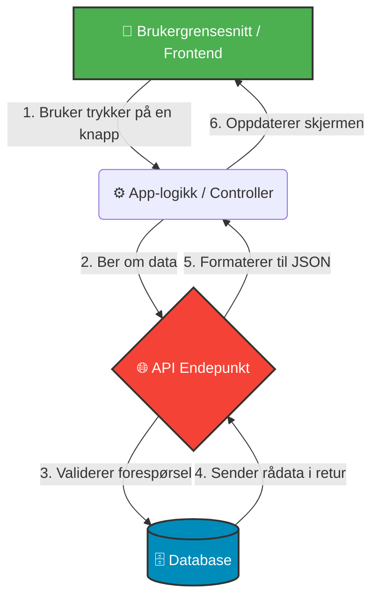

# 📊 Mitt første Mermaid-kart

Dette er en visualisering av hvordan appen min snakker med databasen.

## 📝 Mine Notater til koden over:
- **Appen** er det brukeren ser på skjermen sin.
- **API-et** fungerer som en sikkerhetsvakt for databasen.
- Hvis jeg endrer databasestrukturen, må jeg huske å oppdatere punkt **4** og **5**.
